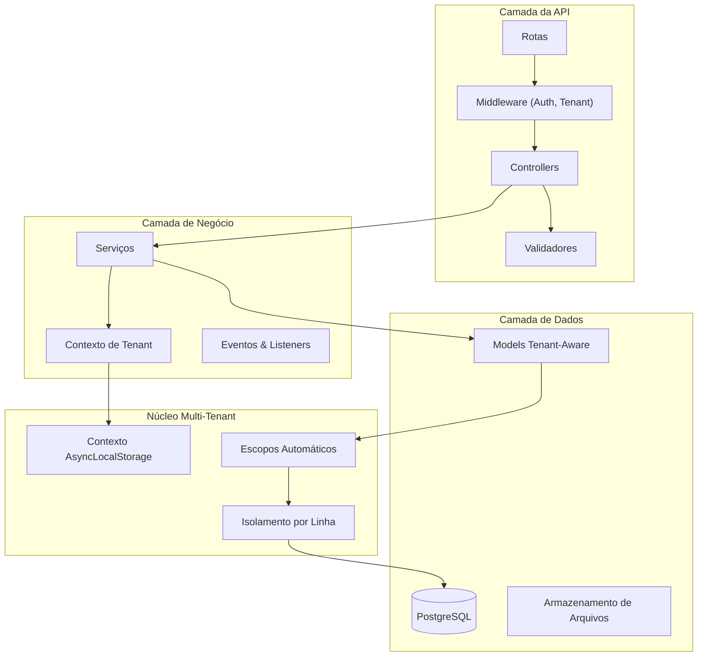

<h1 align="center">
  
</h1>

<p align="center">
  
  
  
  
</p>

<p align="center">
    <a href="README.md">Inglês</a>
    ·
    <a href="README-pt.md">Português</a>
</p>

<p align="center">
  <a href="#bookmark-sobre">Sobre</a>&nbsp;&nbsp;&nbsp;|&nbsp;&nbsp;&nbsp;
  <a href="#rocket-multi-tenant-primeiro">Multi-Tenant Primeiro</a>&nbsp;&nbsp;&nbsp;|&nbsp;&nbsp;&nbsp;
  <a href="#computer-tecnologias">Tecnologias</a>&nbsp;&nbsp;&nbsp;|&nbsp;&nbsp;&nbsp;
  <a href="#package-instalação">Instalação</a>&nbsp;&nbsp;&nbsp;|&nbsp;&nbsp;&nbsp;
  <a href="#memo-licença">Licença</a>
</p>

## :bookmark: Sobre

O **JuridicAI** é uma plataforma SaaS multi-tenant moderna, projetada para gestão de escritórios de advocacia. Construída com **AdonisJS v6**, fornece completo isolamento de dados para cada tenant (escritório), possibilitando gerenciamento seguro de clientes, processos judiciais, prazos, documentos e colaboração em equipe.

Esta plataforma foi projetada para escalabilidade e segurança de dados. Cada escritório opera em um ambiente completamente isolado com escopo automático de queries, prevenindo qualquer vazamento de dados entre tenants. A arquitetura segue os requisitos do domínio jurídico brasileiro com validação integrada de CPF/CNPJ, formatação de números CNJ e trilhas de auditoria prontas para compliance.

### 🏗️ Visão Geral da Arquitetura



## :rocket: Multi-Tenant Primeiro

Esta plataforma foi projetada com multi-tenancy como princípio arquitetural central, não como uma reflexão tardia.

- **Zero Vazamento de Dados**: Escopo automático de tenant no nível do ORM garante que queries nunca cruzem fronteiras de tenants. Verificado por suite de testes abrangente.
- **Domínio Jurídico Brasileiro**: Validação integrada para CPF/CNPJ, formato de número CNJ e padrões de integração com o sistema judiciário brasileiro.
- **Isolamento de Contexto**: Usa AsyncLocalStorage para manter o contexto do tenant durante todo o ciclo de vida da requisição, incluindo jobs em background.
- **Multi-Tenancy Type-Safe**: Cobertura completa de TypeScript garante que tenant_id está sempre presente e corretamente tipado em todas as operações com escopo de tenant.

## 🌟 Principais Funcionalidades

- **🏢 Arquitetura Multi-Tenant**: Isolamento por linha com escopo automático de queries via classe base TenantAwareModel.
- **⚖️ Modelos do Domínio Jurídico**: Clientes, Processos, Prazos, Documentos, Eventos - todos seguindo padrões jurídicos brasileiros.
- **🇧🇷 Especificidades Brasileiras**: Algoritmos de validação CPF/CNPJ, formato CNJ de processos, integrações com tribunais (PJe, e-SAJ).
- **📊 Sistema de Factories**: Geradores de dados de teste com consciência brasileira, CPF/CNPJ válidos e dados realistas de processos jurídicos.
- **🔒 Seguro por Padrão**: Isolamento de tenant verificado por 33 testes passando, cobrindo todos os cenários de isolamento.
- **⚡️ Alta Performance**: Índices otimizados para queries multi-tenant, JSONB para metadados flexíveis.
- **✅ Type-Safe**: Cobertura completa de TypeScript com estratégia de nomenclatura snake_case no ORM.

## :computer: Tecnologias

- **[AdonisJS v6](https://adonisjs.com/)**: Um framework Node.js robusto para o backend.
- **[TypeScript](https://www.typescriptlang.org/)**: Para segurança de tipos em toda a plataforma.
- **[PostgreSQL](https://www.postgresql.org/)**: Banco de dados de produção com suporte JSONB para schemas flexíveis.
- **[SQLite](https://www.sqlite.org/)**: Banco de dados leve para testes rápidos.
- **[VineJS](https://vinejs.dev/)**: Biblioteca moderna de validação para dados de requisição.
- **[Lucid ORM](https://lucid.adonisjs.com/)**: ActiveRecord elegante com escopos de query multi-tenant.
- **[Japa](https://japa.dev/)**: Framework de testes moderno (33 testes passando).

## :package: Instalação

### ✔️ Pré-requisitos

- **Node.js** (v18 ou superior)
- **pnpm** (ou npm/yarn)
- **PostgreSQL** (v14 ou superior)
- **Docker** (opcional, para banco de dados containerizado)

### 🚀 Começando

1. **Clone o repositório:**

   ```sh
   git clone https://github.com/seususuario/juridicai.git
   cd juridicai
   ```

2. **Instale as dependências:**

   ```sh
   pnpm install
   ```

3. **Configure as variáveis de ambiente:**

   ```sh
   cp .env.example .env
   ```

   _Abra o arquivo `.env` e configure suas credenciais de banco de dados e outras configurações._

4. **Execute as migrações do banco de dados:**

   ```sh
   node ace migration:run
   ```

5. **Popule dados de desenvolvimento:**

   ```sh
   node ace db:seed
   ```

6. **Inicie o servidor de desenvolvimento:**
   ```sh
   pnpm dev
   ```
   _Sua API estará disponível em `http://localhost:3333`._

### 📜 Scripts Disponíveis

- `pnpm dev`: Inicia o servidor de desenvolvimento com HMR.
- `pnpm build`: Compila a aplicação para produção.
- `pnpm start`: Executa o servidor pronto para produção.
- `pnpm test`: Executa os testes unitários.
- `pnpm test:e2e`: Executa os testes de ponta a ponta.
- `pnpm lint`: Verifica o código com o linter.
- `pnpm lint:fix`: Corrige problemas de linting automaticamente.
- `pnpm format`: Formata o código com o Prettier.
- `pnpm typecheck`: Executa verificação de tipos TypeScript.

### 🧪 Fluxo de Desenvolvimento

Sempre use comandos Ace do AdonisJS para manter a consistência:

```bash
# Criar models com migrations
node ace make:model Client -m

# Criar controllers
node ace make:controller clients/clients_controller --resource

# Criar services
node ace make:service clients/create_client_service

# Criar validators
node ace make:validator CreateClientValidator

# Criar testes
node ace make:test clients/create_client --suite=functional

# Criar factories
node ace make:factory Client
```

## :memo: Licença

Este projeto está licenciado sob **Licença Proprietária**. Todos os direitos reservados.

---

<p align="center">
  Feito com ❤️ usando AdonisJS v6
</p>
