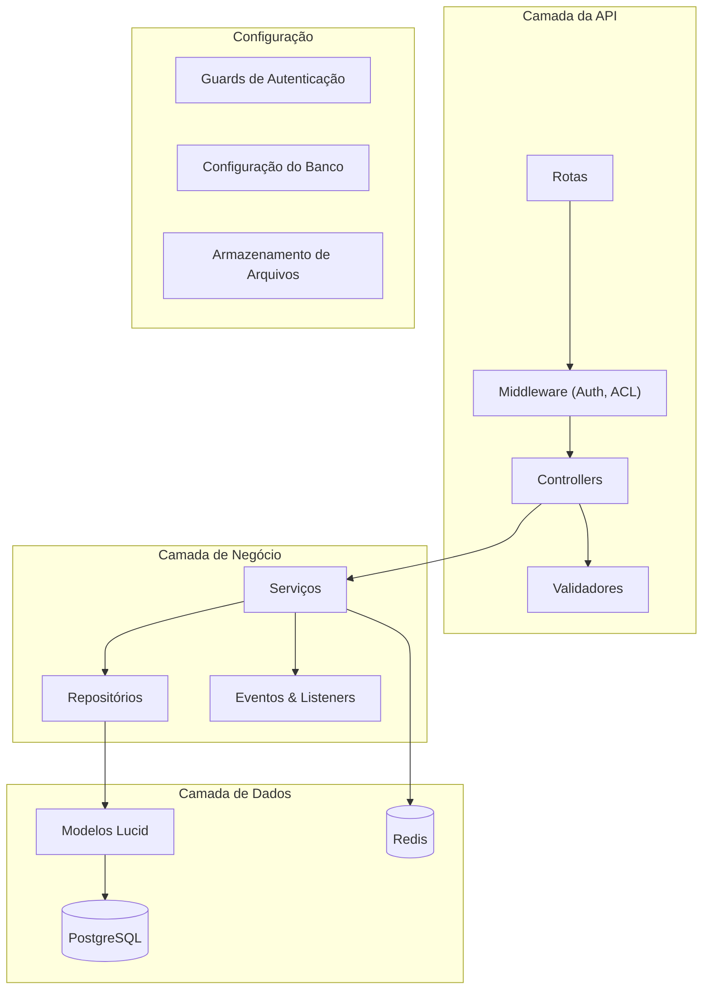

<h1 align="center">
  
</h1>

<p align="center">
  
  
  
  <a href="https://github.com/gabrielmaialva33/adonis-kit/commits/main">
    
  </a>
</p>

<p align="center">
    <a href="README.md">Inglês</a>
    ·
    <a href="README-pt.md">Português</a>
</p>

<p align="center">
  <a href="#bookmark-sobre">Sobre</a>&nbsp;&nbsp;&nbsp;|&nbsp;&nbsp;&nbsp;
  <a href="#rocket-desenvolvimento-ai-first">Desenvolvimento AI-First</a>&nbsp;&nbsp;&nbsp;|&nbsp;&nbsp;&nbsp;
  <a href="#computer-tecnologias">Tecnologias</a>&nbsp;&nbsp;&nbsp;|&nbsp;&nbsp;&nbsp;
  <a href="#package-instalação">Instalação</a>&nbsp;&nbsp;&nbsp;|&nbsp;&nbsp;&nbsp;
  <a href="#memo-licença">Licença</a>
</p>

## :bookmark: Sobre

O **Adonis Kit** é um _starter kit_ de API moderno, opinativo e focado em IA, projetado para acelerar o desenvolvimento de aplicações backend robustas. Construído com **AdonisJS v6**, ele fornece uma base poderosa para criar APIs REST escaláveis com recursos abrangentes de autenticação, autorização e gerenciamento de dados.

Este projeto não é apenas uma coleção de tecnologias; é uma fundação projetada para eficiência, escalabilidade e colaboração transparente com parceiros de desenvolvimento de IA. Ao fornecer uma arquitetura bem definida com recursos como autenticação multi-guard, controle de acesso baseado em papéis (RBAC) e gerenciamento de arquivos prontos para uso, ele permite que desenvolvedores (humanos e IAs) se concentrem na construção de lógicas de negócio únicas, em vez de código repetitivo.

### 🏗️ Visão Geral da Arquitetura



## :rocket: Desenvolvimento AI-First

Este _starter kit_ foi projetado de forma única para maximizar a eficácia da codificação assistida por IA.

- **Base de API Bem Estruturada**: A clara separação de responsabilidades (controllers, serviços, repositórios) facilita para uma IA localizar, entender e modificar partes específicas do código com precisão.
- **Base Fortemente Tipada**: O uso completo de TypeScript cria um contrato claro entre todas as camadas da API. Isso reduz a ambiguidade e permite que a IA entenda estruturas de dados e assinaturas de funções, resultando em menos erros.
- **Arquitetura Modular e Opinativa**: Organização de serviços orientada a domínio e padrões consistentes tornam simples para a IA estender funcionalidades seguindo convenções estabelecidas.
- **Foco na Lógica de Negócio**: Com o boilerplate de autenticação, permissões e armazenamento de arquivos já resolvido, a IA pode ser direcionada para resolver problemas de negócio de nível superior desde o primeiro dia.

## 🌟 Principais Funcionalidades

- **🔐 Autenticação Multi-Guard**: Autenticação baseada em JWT pronta para uso.
- **👥 Controle de Acesso Avançado (RBAC)**: Gerencie permissões de usuário com papéis e regras detalhadas.
- **📁 Gerenciamento de Arquivos**: Serviço de upload de arquivos pré-configurado com suporte para drivers locais, S3 e GCS.
- **⚡️ API de Alta Performance**: Endpoints REST otimizados com cache inteligente e processamento de filas.
- **🔄 Arquitetura Orientada a Eventos**: Sistema de eventos integrado para lógica de aplicação desacoplada e escalável.
- **✅ API Type-Safe**: Cobertura completa de TypeScript com autocompletar e verificação de tipos.
- **🏥 Health Checks**: Endpoint de verificação de saúde integrado para monitoramento.

## :computer: Tecnologias

- **[AdonisJS v6](https://adonisjs.com/)**: Um framework Node.js robusto para o backend.
- **[TypeScript](https://www.typescriptlang.org/)**: Para segurança de tipos em toda a API.
- **[PostgreSQL](https://www.postgresql.org/)**: Um banco de dados relacional confiável e poderoso.
- **[Redis](https://redis.io/)**: Usado para cache, filas e gerenciamento de sessões.
- **[VineJS](https://vinejs.dev/)**: Biblioteca moderna de validação para dados de requisição.
- **[Lucid ORM](https://lucid.adonisjs.com/)**: Implementação elegante do ActiveRecord para AdonisJS.

## :package: Instalação

### ✔️ Pré-requisitos

- **Node.js** (v18 ou superior)
- **pnpm** (ou npm/yarn)
- **Docker** (para rodar PostgreSQL e Redis)

### 🚀 Começando

1. **Clone o repositório:**

   ```sh
   git clone https://github.com/gabrielmaialva33/adonis-kit.git
   cd adonis-kit
   ```

2. **Instale as dependências:**

   ```sh
   pnpm install
   ```

3. **Configure as variáveis de ambiente:**

   ```sh
   cp .env.example .env
   ```

   _Abra o arquivo `.env` e configure suas credenciais de banco de dados e outras configurações._

4. **Execute as migrações do banco de dados:**

   ```sh
   node ace migration:run
   ```

5. **Inicie o servidor de desenvolvimento:**
   ```sh
   pnpm dev
   ```
   _Sua API estará disponível em `http://localhost:3333`._

### 📜 Scripts Disponíveis

- `pnpm dev`: Inicia o servidor de desenvolvimento com HMR.
- `pnpm build`: Compila a aplicação para produção.
- `pnpm start`: Executa o servidor pronto para produção.
- `pnpm test`: Executa os testes unitários.
- `pnpm test:e2e`: Executa os testes de ponta a ponta.
- `pnpm lint`: Verifica o código com o linter.
- `pnpm format`: Formata o código com o Prettier.

## :memo: Licença

Este projeto está licenciado sob a **Licença MIT**. Veja o arquivo [LICENSE](LICENSE) para mais detalhes.

---

<p align="center">
  Feito com ❤️ pela comunidade.
</p>
