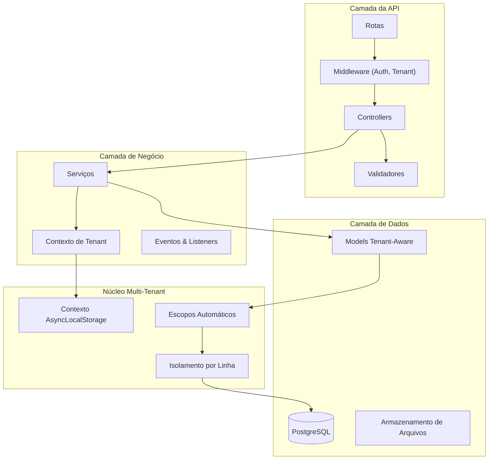

<h1 align="center">
  
</h1>

<p align="center">
  
  
  
  
</p>

<p align="center">
    <a href="README.md">Inglês</a>
    ·
    <a href="README-pt.md">Português</a>
</p>

<p align="center">
  <a href="#bookmark-sobre">Sobre</a>&nbsp;&nbsp;&nbsp;|&nbsp;&nbsp;&nbsp;
  <a href="#bulb-por-que-multi-tenant">Por Que Multi-Tenant</a>&nbsp;&nbsp;&nbsp;|&nbsp;&nbsp;&nbsp;
  <a href="#rocket-guia-rápido">Guia Rápido</a>&nbsp;&nbsp;&nbsp;|&nbsp;&nbsp;&nbsp;
  <a href="#computer-tecnologias">Tecnologias</a>&nbsp;&nbsp;&nbsp;|&nbsp;&nbsp;&nbsp;
  <a href="#package-instalação">Instalação</a>&nbsp;&nbsp;&nbsp;|&nbsp;&nbsp;&nbsp;
  <a href="#memo-licença">Licença</a>
</p>

## :bookmark: Sobre

O **JuridicAI** é uma plataforma SaaS multi-tenant moderna, projetada para gestão de escritórios de advocacia. Construída com **AdonisJS v6**, fornece completo isolamento de dados para cada tenant (escritório), possibilitando gerenciamento seguro de clientes, processos judiciais, prazos, documentos e colaboração em equipe.

Esta plataforma foi projetada para escalabilidade e segurança de dados. Cada escritório opera em um ambiente completamente isolado com escopo automático de queries, prevenindo qualquer vazamento de dados entre tenants. A arquitetura segue os requisitos do domínio jurídico brasileiro com validação integrada de CPF/CNPJ, formatação de números CNJ e trilhas de auditoria prontas para compliance.

### 🏗️ Visão Geral da Arquitetura



## :bulb: Por Que Multi-Tenant?

### Justificativa de Negócio

Multi-tenancy foi escolhido como princípio arquitetural central do JuridicAI por várias razões estratégicas:

**Eficiência de Custos** 💰

- Infraestrutura única serve múltiplos escritórios
- Recursos compartilhados reduzem custos operacionais em ~70%
- Economias de escala beneficiam todos os tenants

**Excelência Operacional** ⚙️

- Um único deploy para todos os tenants
- Atualizações e manutenção centralizadas
- Rollout consistente de features

**Escalabilidade** 📈

- Adicionar novos escritórios sem mudanças de infraestrutura
- Escalabilidade horizontal beneficia todos os tenants
- Pool de recursos otimiza utilização

**Segurança de Dados** 🔒

- Isolamento completo no nível de linha do banco
- Zero vazamentos de dados verificado por testes abrangentes
- Trilhas de auditoria prontas para compliance por tenant

### Por Que Isolamento por Linha?

Escolhemos **isolamento por linha** (banco compartilhado, coluna tenant_id) em vez de schema-por-tenant ou banco-por-tenant por:

✅ **Simplicidade**: Migration única, backups mais fáceis, deploy simplificado
✅ **Custo**: Sem overhead de banco por tenant
✅ **Performance**: Otimizado com índices compostos (tenant_id, ...)
✅ **Analytics**: Insights cross-tenant para melhorias da plataforma
✅ **Comprovado em Escala**: Funciona bem para 1000+ tenants

## :rocket: Guia Rápido

### Criando Recursos com Escopo de Tenant

Todos os models estendem `TenantAwareModel` para isolamento automático:

```typescript
// app/models/client.ts
import TenantAwareModel from '#models/tenant_aware_model'
import { column } from '@adonisjs/lucid/orm'

export default class Client extends TenantAwareModel {
  @column({ isPrimary: true })
  declare id: number

  @column()
  declare tenant_id: string // Definido automaticamente na criação

  @column()
  declare full_name: string

  @column()
  declare email: string
}
```

### Trabalhando com Contexto de Tenant

```typescript
import TenantContextService from '#services/tenants/tenant_context_service'
import Client from '#models/client'

// Executar dentro do contexto do tenant
await TenantContextService.run(
  { tenant_id: 'uuid-aqui', tenant: null, user_id: null, tenant_user: null },
  async () => {
    // Todas as queries automaticamente com escopo deste tenant
    const client = await Client.create({
      full_name: 'João Silva',
      email: 'joao@exemplo.com',
      // tenant_id definido automaticamente!
    })

    // Retorna apenas clientes do tenant atual
    const allClients = await Client.all()
  }
)
```

### Query Scopes

```typescript
// Escopo automático (comportamento padrão)
const clients = await Client.all()
// SELECT * FROM clients WHERE tenant_id = 'uuid-do-tenant-atual'

// Escopo manual de tenant
const tenant1Clients = await Client.query().apply((scopes) => scopes.forTenant('uuid-tenant-1'))

// Ignorar escopo (⚠️ SOMENTE ADMIN - use com cautela)
const allClients = await Client.query().apply((scopes) => scopes.withoutTenantScope())
```

### Testando com Tenants

```typescript
import { test } from '@japa/runner'
import { ClientFactory } from '#database/factories/client_factory'
import { TenantFactory } from '#database/factories/tenant_factory'
import TenantContextService from '#services/tenants/tenant_context_service'

test('cliente pertence ao tenant correto', async ({ assert }) => {
  const tenant = await TenantFactory.create()

  const client = await TenantContextService.run(
    { tenant_id: tenant.id, tenant, user_id: null, tenant_user: null },
    async () => {
      return await ClientFactory.create()
    }
  )

  assert.equal(client.tenant_id, tenant.id)
})
```

## 🌟 Principais Funcionalidades

- **🏢 Multi-Tenancy por Linha**: Isolamento completo de dados com escopo automático de queries via `TenantAwareModel`.
- **⚖️ Domínio Jurídico Brasileiro**: Validação CPF/CNPJ, formato CNJ (NNNNNNN-DD.AAAA.J.TR.OOOO), integrações com tribunais.
- **🔐 Contexto AsyncLocalStorage**: Contexto de tenant preservado em operações assíncronas, incluindo jobs em background.
- **📊 Factories Inteligentes**: Geram dados jurídicos brasileiros válidos (CPF com checksum, números CNJ realistas).
- **🔒 Segurança em Primeiro Lugar**: Fallback HttpContext, isolamento de tenant verificado por 33 testes.
- **⚡️ Performance Otimizada**: Índices compostos (tenant_id, ...), JSONB para metadados flexíveis.
- **✅ Type-Safe**: Cobertura completa de TypeScript com estratégia de nomenclatura snake_case no ORM.

## :computer: Tecnologias

- **[AdonisJS v6](https://adonisjs.com/)**: Framework Node.js moderno com suporte TypeScript de primeira classe.
- **[TypeScript](https://www.typescriptlang.org/)**: Segurança de tipos e excelente experiência de desenvolvimento.
- **[PostgreSQL](https://www.postgresql.org/)**: Banco de dados de produção com JSONB e indexação avançada.
- **[SQLite](https://www.sqlite.org/)**: Banco de dados rápido em memória para testes.
- **[VineJS](https://vinejs.dev/)**: Biblioteca de validação moderna e type-safe.
- **[Lucid ORM](https://lucid.adonisjs.com/)**: ActiveRecord elegante com query scopes.
- **[Japa](https://japa.dev/)**: Framework de testes delicioso (33 testes passando).

## :package: Instalação

### ✔️ Pré-requisitos

- **Node.js** (v18 ou superior)
- **pnpm** (recomendado) ou npm/yarn
- **PostgreSQL** (v14 ou superior)
- **Docker** (opcional, para desenvolvimento containerizado)

### 🚀 Começando

1. **Clone e instale:**

   ```bash
   git clone https://github.com/seususuario/juridicai.git
   cd juridicai
   pnpm install
   ```

2. **Configure o ambiente:**

   ```bash
   cp .env.example .env
   ```

   Configure seu `.env`:

   ```env
   DB_CONNECTION=postgres
   DB_HOST=localhost
   DB_PORT=5432
   DB_USER=postgres
   DB_PASSWORD=sua_senha
   DB_DATABASE=juridicai_dev
   ```

3. **Configure o banco de dados:**

   ```bash
   # Criar banco de dados
   createdb juridicai_dev

   # Executar migrations
   node ace migration:run

   # Popular dados de desenvolvimento
   node ace db:seed
   ```

4. **Iniciar desenvolvimento:**
   ```bash
   pnpm dev
   ```
   Visite `http://localhost:3333`

### 📜 Scripts Disponíveis

```bash
# Desenvolvimento
pnpm dev              # Iniciar com HMR
pnpm build            # Build de produção
pnpm start            # Executar servidor de produção

# Testes
pnpm test             # Testes unitários (rápido)
pnpm test:e2e         # Todos os testes (mais lento)

# Qualidade de Código
pnpm lint             # ESLint
pnpm lint:fix         # Corrigir problemas automaticamente
pnpm typecheck        # Verificação TypeScript
pnpm format           # Prettier

# Banco de Dados
node ace migration:run      # Executar migrations
node ace migration:rollback # Reverter
node ace db:seed            # Popular dados
```

### 🧪 Fluxo de Desenvolvimento

Sempre use comandos Ace do AdonisJS:

```bash
# Models & Migrations
node ace make:model Client -m

# Controllers
node ace make:controller clients/clients_controller --resource

# Services
node ace make:service clients/create_client_service

# Validators
node ace make:validator CreateClientValidator

# Testes
node ace make:test clients/create_client --suite=functional

# Factories
node ace make:factory Client
```

## 🏗️ Decisões Arquiteturais

### Pattern TenantAwareModel

**Decisão**: Usar método `boot()` com hooks programáticos em vez de decorators.

**Razão**: Decorators de classes abstratas não funcionam de forma confiável no TypeScript/AdonisJS.

**Implementação**:

```typescript
static boot() {
  if (this.booted) return
  super.boot()

  // Definir tenant_id automaticamente na criação
  this.before('create', (model) => {
    if (!model.tenant_id) {
      model.tenant_id = TenantContextService.assertTenantId()
    }
  })

  // Escopo automático de queries
  this.before('find', (query) => {
    if (!query._skipTenantScope) {
      const tenantId = TenantContextService.getCurrentTenantId()
      if (tenantId) query.where('tenant_id', tenantId)
    }
  })
}
```

### Manipulação JSONB/ARRAY

**Decisão**: Manipular tipos string e object nas funções `consume`.

**Razão**: PostgreSQL retorna JSONB como objetos, não strings.

**Pattern**:

```typescript
@column({
  prepare: (value: Record<string, any> | null) =>
    value ? JSON.stringify(value) : null,
  consume: (value: string | null) =>
    value ? (typeof value === 'string' ? JSON.parse(value) : value) : null,
})
declare metadata: Record<string, any> | null
```

### Fallback HttpContext

**Decisão**: Fallback para header `X-Tenant-Id` quando AsyncLocalStorage indisponível.

**Razão**: Jobs em background, comandos CLI não têm contexto AsyncLocalStorage.

**Implementação**:

```typescript
getCurrentTenantId(): string | null {
  // Prioridade 1: AsyncLocalStorage
  const context = this.getContext()
  if (context?.tenant_id) return context.tenant_id

  // Prioridade 2: Header HttpContext
  try {
    const ctx = HttpContext.getOrFail()
    return ctx.request.header('x-tenant-id') ?? null
  } catch {
    return null
  }
}
```

## 🧪 Testes

### Executar Testes

```bash
pnpm test       # Apenas testes unitários
pnpm test:e2e   # Todos os testes
```

### Cobertura de Testes (33 passando)

- **TenantContextService** (10 testes): Isolamento de contexto, fallback, assertions
- **TenantAwareModel** (7 testes): Auto-escopo, auto-atribuição, bypass
- **Isolamento multi-tenant** (14 testes): Prevenção de vazamento de dados, queries cross-tenant
- **Domínio jurídico** (2 testes): Workflow Cliente-Processo

### Exemplo de Teste

```typescript
test('previne acesso cross-tenant de dados', async ({ assert }) => {
  const tenant1 = await TenantFactory.create()
  const tenant2 = await TenantFactory.create()

  // Criar cliente para tenant 1
  const client1 = await TenantContextService.run(
    { tenant_id: tenant1.id, tenant: tenant1, user_id: null, tenant_user: null },
    async () => await ClientFactory.create()
  )

  // Query do contexto do tenant 2
  const result = await TenantContextService.run(
    { tenant_id: tenant2.id, tenant: tenant2, user_id: null, tenant_user: null },
    async () => await Client.find(client1.id)
  )

  assert.isNull(result) // ✅ Tenant 2 não pode ver dados do tenant 1
})
```

## 🔧 Solução de Problemas

### "No tenant ID in current context"

**Causa**: Tentando criar/consultar recurso com escopo de tenant fora do TenantContext.

**Solução**:

```typescript
// ❌ Errado
const client = await Client.create({ full_name: 'João' })

// ✅ Correto
await TenantContextService.run({ tenant_id: 'uuid', ... }, async () => {
  const client = await Client.create({ full_name: 'João' })
})
```

### Campo JSONB retorna "[object Object]"

**Causa**: Função consume antiga tenta fazer JSON.parse de um objeto já parseado.

**Solução**: Use o pattern das Decisões Arquiteturais acima com verificação `typeof`.

### Query retorna dados do tenant errado

**Causa**: Usando `withoutTenantScope()` ou contexto de tenant ausente.

**Solução**: Garanta que TenantContext está definido e evite `withoutTenantScope()` a menos que absolutamente necessário.

## ⚡ Performance & Segurança

### Estratégia de Indexação

Todas as tabelas com escopo de tenant usam índices compostos:

```sql
CREATE INDEX idx_clients_tenant ON clients(tenant_id);
CREATE INDEX idx_clients_tenant_email ON clients(tenant_id, email);
```

### Checklist de Segurança

- ✅ Todos os models estendem `TenantAwareModel`
- ✅ Todas as queries automaticamente com escopo
- ✅ Isolamento de tenant verificado por testes
- ✅ Sem SQL raw sem filtro tenant_id
- ✅ Fallback HttpContext para requisições
- ✅ Operações admin usam `withoutTenantScope()` explícito

## :memo: Licença

Este projeto está licenciado sob **Licença Proprietária**. Todos os direitos reservados.

---

<p align="center">
  Feito com ❤️ usando AdonisJS v6 | <a href="https://github.com/seususuario/juridicai/issues">Reportar Bug</a> | <a href="https://github.com/seususuario/juridicai/pulls">Solicitar Feature</a>
</p>
