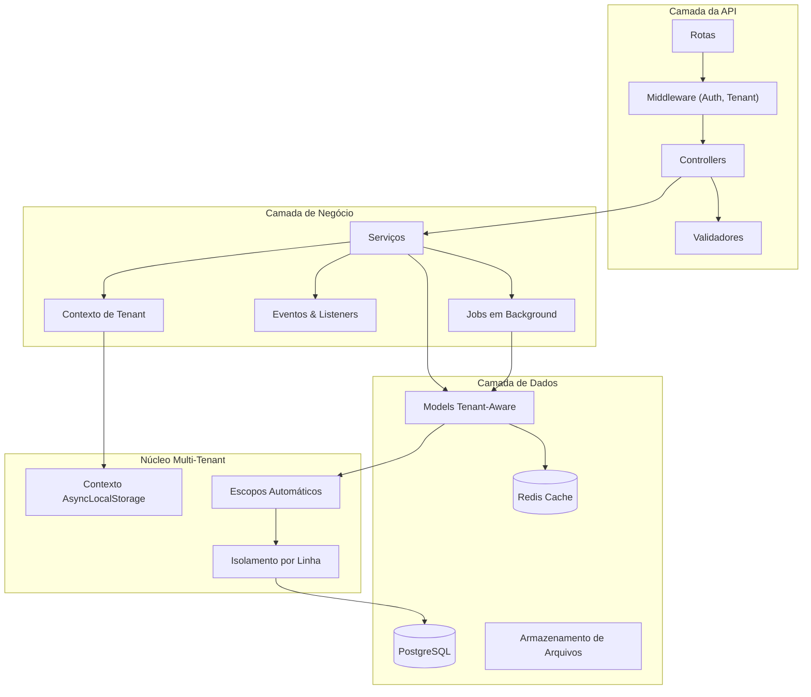

<h1 align="center">
  
</h1>

<p align="center">
  
  
  
  
  
</p>

<p align="center">
    <a href="README.md">English</a>
    ·
    <a href="README-pt.md">Portuguese</a>
</p>

<p align="center">
  <a href="#bookmark-sobre">Sobre</a>&nbsp;&nbsp;&nbsp;|&nbsp;&nbsp;&nbsp;
  <a href="#bulb-por-que-multi-tenant">Por Que Multi-Tenant</a>&nbsp;&nbsp;&nbsp;|&nbsp;&nbsp;&nbsp;
  <a href="#rocket-guia-rápido">Guia Rápido</a>&nbsp;&nbsp;&nbsp;|&nbsp;&nbsp;&nbsp;
  <a href="#computer-tecnologias">Tecnologias</a>&nbsp;&nbsp;&nbsp;|&nbsp;&nbsp;&nbsp;
  <a href="#package-instalação">Instalação</a>&nbsp;&nbsp;&nbsp;|&nbsp;&nbsp;&nbsp;
  <a href="#wrench-configuração">Configuração</a>&nbsp;&nbsp;&nbsp;|&nbsp;&nbsp;&nbsp;
  <a href="#file_folder-estrutura-do-projeto">Estrutura do Projeto</a>&nbsp;&nbsp;&nbsp;|&nbsp;&nbsp;&nbsp;
  <a href="#memo-licença">Licença</a>
</p>

## :bookmark: Sobre

O **JuridicAI** é uma plataforma SaaS multi-tenant moderna, projetada para gestão de escritórios de advocacia.
Construída com **AdonisJS v6**, fornece completo isolamento de dados para cada tenant (escritório), possibilitando
gerenciamento seguro de clientes, processos judiciais, prazos, documentos e colaboração em equipe.

Esta plataforma foi projetada para escalabilidade e segurança de dados. Cada escritório opera em um ambiente
completamente isolado com escopo automático de queries, prevenindo qualquer vazamento de dados entre tenants. A
arquitetura segue os requisitos do domínio jurídico brasileiro com validação integrada de CPF/CNPJ, formatação de
números CNJ e trilhas de auditoria prontas para compliance.

### 🏗️ Visão Geral da Arquitetura



## :bulb: Por Que Multi-Tenant?

### Justificativa de Negócio

Multi-tenancy foi escolhido como princípio arquitetural central do JuridicAI por várias razões estratégicas:

**Eficiência de Custos** 💰

- Infraestrutura única serve múltiplos escritórios
- Recursos compartilhados reduzem custos operacionais em ~70%
- Economias de escala beneficiam todos os tenants

**Excelência Operacional** ⚙️

- Um único deploy para todos os tenants
- Atualizações e manutenção centralizadas
- Rollout consistente de features

**Escalabilidade** 📈

- Adicionar novos escritórios sem mudanças de infraestrutura
- Escalabilidade horizontal beneficia todos os tenants
- Pool de recursos otimiza utilização

**Segurança de Dados** 🔒

- Isolamento completo no nível de linha do banco
- Zero vazamentos de dados verificado por testes abrangentes
- Trilhas de auditoria prontas para compliance por tenant

### Por Que Isolamento por Linha?

Escolhemos **isolamento por linha** (banco compartilhado, coluna tenant_id) em vez de schema-por-tenant ou
banco-por-tenant por:

✅ **Simplicidade**: Migration única, backups mais fáceis, deploy simplificado
✅ **Custo**: Sem overhead de banco por tenant
✅ **Performance**: Otimizado com índices compostos (tenant_id, ...)
✅ **Analytics**: Insights cross-tenant para melhorias da plataforma
✅ **Comprovado em Escala**: Funciona bem para 1000+ tenants

## :rocket: Guia Rápido

### Criando Recursos com Escopo de Tenant

Todos os models usam o mixin `withTenantScope` para isolamento automático:

```typescript
// app/models/client.ts
import { BaseModel, column } from '@adonisjs/lucid/orm'
import { compose } from '@adonisjs/core/helpers'
import { withTenantScope } from '#mixins/with_tenant_scope'

const TenantScoped = withTenantScope()

export default class Client extends compose(BaseModel, TenantScoped) {
  @column({ isPrimary: true })
  declare id: number

  @column()
  declare tenant_id: string // Definido automaticamente na criação

  @column()
  declare full_name: string

  @column()
  declare email: string
}
```

### Trabalhando com Contexto de Tenant

```typescript
import TenantContextService from '#services/tenants/tenant_context_service'
import Client from '#models/client'

// Executar dentro do contexto do tenant
await TenantContextService.run(
  { tenant_id: 'uuid-aqui', tenant: null, user_id: null, tenant_user: null },
  async () => {
    // Todas as queries automaticamente com escopo deste tenant
    const client = await Client.create({
      full_name: 'João Silva',
      email: 'joao@exemplo.com',
      // tenant_id definido automaticamente!
    })

    // Retorna apenas clientes do tenant atual
    const allClients = await Client.all()
  }
)
```

### Query Scopes

```typescript
// Escopo automático (comportamento padrão)
const clients = await Client.all()
// SELECT * FROM clients WHERE tenant_id = 'uuid-do-tenant-atual'

// Escopo manual de tenant
const tenant1Clients = await Client.query().apply((scopes) => scopes.forTenant('uuid-tenant-1'))

// Ignorar escopo (⚠️ SOMENTE ADMIN - use com cautela)
const allClients = await Client.query().apply((scopes) => scopes.withoutTenantScope())
```

### Testando com Tenants

```typescript
import { test } from '@japa/runner'
import { ClientFactory } from '#database/factories/client_factory'
import { TenantFactory } from '#database/factories/tenant_factory'
import TenantContextService from '#services/tenants/tenant_context_service'

test('cliente pertence ao tenant correto', async ({ assert }) => {
  const tenant = await TenantFactory.create()

  const client = await TenantContextService.run(
    { tenant_id: tenant.id, tenant, user_id: null, tenant_user: null },
    async () => {
      return await ClientFactory.create()
    }
  )

  assert.equal(client.tenant_id, tenant.id)
})
```

## 🌟 Principais Funcionalidades

- **🏢 Multi-Tenancy por Linha**: Isolamento completo de dados com escopo automático de queries via mixin `withTenantScope`.
- **⚖️ Domínio Jurídico Brasileiro**: Validação CPF/CNPJ, formato CNJ (NNNNNNN-DD.AAAA.J.TR.OOOO), integrações com
  tribunais.
- **🔐 Contexto AsyncLocalStorage**: Contexto de tenant preservado em operações assíncronas, incluindo jobs em
  background.
- **📊 Factories Inteligentes**: Geram dados jurídicos brasileiros válidos (CPF com checksum, números CNJ realistas).
- **🔒 Segurança em Primeiro Lugar**: Fallback HttpContext, isolamento de tenant verificado por testes abrangentes.
- **⚡️ Performance Otimizada**: Índices compostos (tenant_id, ...), JSONB para metadados flexíveis.
- **✅ Type-Safe**: Cobertura completa de TypeScript com estratégia de nomenclatura snake_case no ORM.
- **🔄 Jobs em Background**: Filas robustas com Bull Queue e Redis para processamento assíncrono.
- **🌍 Internacionalização**: Suporte multi-idioma com i18n (pt-BR, en).
- **💾 Armazenamento Flexível**: Suporte para sistema de arquivos local, AWS S3 e Google Cloud Storage.

## :computer: Tecnologias

### Framework Core

- **[AdonisJS v6.19](https://adonisjs.com/)**: Framework Node.js moderno com suporte TypeScript de primeira classe e
  arquitetura modular.
- **[TypeScript 5.9](https://www.typescriptlang.org/)**: Segurança de tipos estrita e excelente experiência de
  desenvolvimento.
- **[Node.js 18+](https://nodejs.org/)**: Runtime JavaScript de alto desempenho.

### Banco de Dados & ORM

- **[PostgreSQL](https://www.postgresql.org/)**: Banco de dados relacional de produção com JSONB e indexação avançada.
- **[Lucid ORM](https://lucid.adonisjs.com/)**: ActiveRecord elegante com query scopes e suporte multi-tenant.
- **[SQLite](https://www.sqlite.org/)**: Banco em memória para testes rápidos.

### Autenticação & Segurança

- **[@adonisjs/auth](https://docs.adonisjs.com/guides/authentication)**: Sistema de autenticação com guards de sessão e
  JWT.
- **[@adonisjs/shield](https://docs.adonisjs.com/guides/security/introduction)**: Proteção CSRF, CSP, e headers de
  segurança.
- **[@adonisjs/cors](https://docs.adonisjs.com/guides/security/cors)**: Gerenciamento de políticas CORS.
- **[@adonisjs/limiter](https://docs.adonisjs.com/guides/security/rate-limiting)**: Rate limiting baseado em banco de
  dados.
- **[Argon2](https://github.com/ranisalt/node-argon2)**: Hashing seguro de senhas (vencedor do Password Hashing
  Competition).

### Infraestrutura

- **[Redis](https://redis.io/)**: Cache em memória e gerenciamento de filas.
- **[@adonisjs/redis](https://docs.adonisjs.com/guides/database/redis)**: Cliente Redis otimizado para AdonisJS.
- **[@adonisjs/cache](https://docs.adonisjs.com/guides/cache)**: Sistema de cache com suporte a múltiplos drivers.
- **[@rlanz/bull-queue](https://github.com/Rlanz/bull-queue)**: Filas robustas para processamento em background.

### Testes

- **[Japa](https://japa.dev/)**: Framework de testes moderno com suporte a múltiplas suítes.
- **[@japa/api-client](https://japa.dev/plugins/api-client)**: Cliente HTTP para testes de API.
- **[@japa/assert](https://japa.dev/plugins/assert)**: Biblioteca de assertions rica.
- **[@japa/plugin-adonisjs](https://japa.dev/plugins/adonisjs)**: Integração com AdonisJS para testes.

### Armazenamento & Arquivos

- **[@adonisjs/drive](https://docs.adonisjs.com/guides/file-system)**: Sistema de arquivos unificado com múltiplos
  drivers.
- **[@aws-sdk/client-s3](https://aws.amazon.com/sdk-for-javascript/)**: Driver AWS S3 para armazenamento em nuvem.
- **[@google-cloud/storage](https://cloud.google.com/nodejs/docs/reference/storage/latest)**: Driver Google Cloud
  Storage.

### Comunicação

- **[@adonisjs/mail](https://docs.adonisjs.com/guides/mail)**: Sistema de envio de emails com múltiplos drivers.
- **[@adonisjs/session](https://docs.adonisjs.com/guides/session)**: Gerenciamento de sessão com suporte a cookies.

### Validação & Transformação

- **[VineJS](https://vinejs.dev/)**: Biblioteca de validação type-safe e performática.
- **[Luxon](https://moment.github.io/luxon/)**: Manipulação moderna de datas e fusos horários.

### Internacionalização

- **[@adonisjs/i18n](https://docs.adonisjs.com/guides/i18n)**: Sistema completo de internacionalização e localização.

### Ferramentas de Desenvolvimento

- **[ESLint](https://eslint.org/)**: Linter com configuração AdonisJS.
- **[Prettier](https://prettier.io/)**: Formatação consistente de código.
- **[pino-pretty](https://github.com/pinojs/pino-pretty)**: Logs bonitos para desenvolvimento.
- **[hot-hook](https://github.com/julien-f/hot-hook)**: Hot Module Replacement para desenvolvimento rápido.

## :package: Instalação

### ✔️ Pré-requisitos

- **Node.js** (v18 ou superior)
- **pnpm** (recomendado) ou npm/yarn
- **PostgreSQL** (v14 ou superior)
- **Redis** (para cache e filas)
- **Docker** (opcional, para desenvolvimento containerizado)

### 🚀 Começando

1. **Clone e instale:**

   ```bash
   git clone https://github.com/seususuario/juridicai.git
   cd juridicai
   pnpm install
   ```

2. **Configure o ambiente:**

   ```bash
   cp .env.example .env
   ```

   **Importante:** Gere a APP_KEY antes de executar a aplicação:

   ```bash
   node ace generate:key
   ```

   Configure seu `.env`:

   ```env
   # Application
   APP_KEY=<gerado-pelo-comando-acima>
   PORT=3333
   HOST=localhost

   # Database
   DB_CONNECTION=postgres
   DB_HOST=localhost
   DB_PORT=5432
   DB_USER=postgres
   DB_PASSWORD=sua_senha
   DB_DATABASE=juridicai_dev

   # Redis
   REDIS_HOST=127.0.0.1
   REDIS_PORT=6379
   REDIS_PASSWORD=
   ```

3. **Configure o banco de dados:**

   ```bash
   # Criar banco de dados PostgreSQL
   createdb juridicai_dev

   # Executar migrations
   node ace migration:run

   # Popular dados de desenvolvimento
   node ace db:seed
   ```

4. **Configure o Redis:**

   ```bash
   # macOS (via Homebrew)
   brew install redis
   brew services start redis

   # Ubuntu/Debian
   sudo apt-get install redis-server
   sudo systemctl start redis

   # Verificar se está rodando
   redis-cli ping  # Deve retornar "PONG"
   ```

5. **Iniciar desenvolvimento:**
   ```bash
   pnpm dev
   ```
   Visite `http://localhost:3333`

### 📜 Scripts Disponíveis

```bash
# Desenvolvimento
pnpm dev              # Iniciar com HMR
pnpm build            # Build de produção
pnpm start            # Executar servidor de produção

# Testes
pnpm test             # Testes unitários (rápido)
pnpm test:e2e         # Todos os testes (mais lento)

# Qualidade de Código
pnpm lint             # ESLint
pnpm lint:fix         # Corrigir problemas automaticamente
pnpm typecheck        # Verificação TypeScript
pnpm format           # Prettier

# Banco de Dados
node ace migration:run      # Executar migrations
node ace migration:rollback # Reverter
node ace db:seed            # Popular dados
```

### 🧪 Fluxo de Desenvolvimento

Sempre use comandos Ace do AdonisJS:

```bash
# Models & Migrations
node ace make:model Client -m

# Controllers
node ace make:controller clients/clients_controller --resource

# Services
node ace make:service clients/create_client_service

# Validators
node ace make:validator CreateClientValidator

# Testes
node ace make:test clients/create_client --suite=functional

# Factories
node ace make:factory Client
```

## :wrench: Configuração

### Variáveis de Ambiente

O JuridicAI usa variáveis de ambiente para configuração. Copie `.env.example` para `.env` e ajuste conforme necessário.

#### Application

```env
TZ=UTC                          # Fuso horário (UTC recomendado para produção)
PORT=3333                       # Porta do servidor
HOST=localhost                  # Host do servidor
LOG_LEVEL=info                  # Nível de log (trace, debug, info, warn, error, fatal)
APP_KEY=                        # OBRIGATÓRIO: Gere com `node ace generate:key`
NODE_ENV=development            # Ambiente (development, production, test)
```

**⚠️ Importante:** `APP_KEY` é obrigatória e deve ser gerada com `node ace generate:key` antes de executar a aplicação.

#### Database

```env
DB_CONNECTION=postgres          # Driver do banco (postgres, mysql, sqlite)
DB_HOST=localhost               # Host do PostgreSQL
DB_PORT=5432                    # Porta do PostgreSQL
DB_USER=postgres                # Usuário do banco
DB_PASSWORD=postgres            # Senha do banco
DB_DATABASE=juridicai_dev       # Nome do banco de dados
```

#### Redis

```env
REDIS_HOST=127.0.0.1           # Host do Redis
REDIS_PORT=6379                # Porta do Redis
REDIS_PASSWORD=                # Senha do Redis (deixe vazio se não houver)
```

Redis é usado para:

- **Cache**: Melhorar performance de consultas frequentes
- **Filas**: Processar jobs em background com Bull Queue
- **Rate Limiting**: Limitar requisições por IP/usuário
- **Sessões**: Armazenamento de sessão (opcional)

#### Mail

```env
MAIL_MAILER=mailgun                      # Driver de email (mailgun, smtp, ses)
MAIL_FROM_ADDRESS=noreply@example.com    # Email remetente padrão
MAIL_FROM_NAME="JuridicAI"               # Nome remetente padrão

# Mailgun (Recomendado)
MAILGUN_API_KEY=your-mailgun-api-key
MAILGUN_DOMAIN=your-mailgun-domain
MAILGUN_BASE_URL=https://api.mailgun.net/v3

# SMTP (Alternativa ao Mailgun)
SMTP_HOST=smtp.mailgun.org
SMTP_PORT=587
SMTP_USER=your-smtp-username
SMTP_PASS=your-smtp-password
```

#### Session & Security

```env
SESSION_DRIVER=cookie          # Driver de sessão (cookie, redis, database)
LIMITER_STORE=database         # Armazenamento do rate limiter (database, redis)
```

#### Storage

```env
DRIVE_DISK=fs                  # Driver de armazenamento (fs, s3, gcs)
```

Drivers disponíveis:

- `fs`: Sistema de arquivos local (padrão)
- `s3`: Amazon S3
- `gcs`: Google Cloud Storage

#### Optional: Cloud Storage

**AWS S3:**

```env
S3_KEY=your-aws-access-key-id
S3_SECRET=your-aws-secret-access-key
S3_BUCKET=your-bucket-name
S3_REGION=us-east-1
S3_ENDPOINT=                   # Opcional: para S3-compatible services
```

**Google Cloud Storage:**

```env
GCS_KEY_FILENAME=path/to/service-account-key.json
GCS_BUCKET=your-bucket-name
```

### Ambientes

O projeto suporta múltiplos ambientes:

- **development**: Desenvolvimento local com hot reload
- **test**: Execução de testes (usa `.env.test`)
- **production**: Ambiente de produção

Cada ambiente pode ter seu próprio arquivo `.env`:

- `.env` - Desenvolvimento (padrão)
- `.env.test` - Testes
- `.env.production` - Produção

## :file_folder: Estrutura do Projeto

### Layout de Diretórios

```
juridicai/
├── app/
│   ├── controllers/        # Controladores HTTP (rotas de API)
│   ├── models/            # Models do Lucid ORM (todos usam mixin withTenantScope)
│   ├── services/          # Lógica de negócio e casos de uso
│   ├── middleware/        # Middleware customizado (auth, tenant, etc.)
│   ├── validators/        # Schemas de validação VineJS
│   ├── policies/          # Políticas de autorização
│   ├── repositories/      # Camada de repositório (opcional)
│   ├── events/            # Definições de eventos
│   ├── listeners/         # Event listeners
│   ├── mails/             # Templates de email
│   ├── exceptions/        # Exception handlers customizados
│   └── shared/            # Código compartilhado e utilitários
│
├── config/                # Arquivos de configuração
│   ├── app.ts            # Configuração da aplicação
│   ├── database.ts       # Configuração do banco de dados
│   ├── auth.ts           # Configuração de autenticação
│   ├── cors.ts           # Configuração CORS
│   ├── mail.ts           # Configuração de email
│   └── ...
│
├── database/
│   ├── migrations/       # Migrations do banco de dados
│   ├── seeders/          # Database seeders
│   └── factories/        # Model factories para testes
│
├── start/
│   ├── routes.ts         # Definições de rotas
│   └── kernel.ts         # Registro de middleware global
│
├── tests/
│   ├── unit/             # Testes unitários (rápidos, isolados)
│   └── functional/       # Testes funcionais (E2E, integração)
│
├── providers/            # Service providers customizados
├── commands/             # Comandos Ace customizados
├── resources/
│   └── lang/             # Arquivos de tradução i18n
├── storage/              # Armazenamento local de arquivos
├── tmp/                  # Arquivos temporários
└── public/               # Assets públicos (se houver)
```

### Aliases de Importação

O projeto usa aliases de importação com prefixo `#` para importações mais limpas:

```typescript
// ❌ Evite caminhos relativos
import User from '../../models/user.js'
import UserService from '../../../services/user_service.js'

// ✅ Use aliases
import User from '#models/user'
import UserService from '#services/user_service'
import { HttpContext } from '#controllers/http_context'
```

**Aliases Disponíveis:**

| Alias             | Caminho                   | Uso                            |
| ----------------- | ------------------------- | ------------------------------ |
| `#controllers/*`  | `./app/controllers/*.js`  | Controladores HTTP             |
| `#models/*`       | `./app/models/*.js`       | Models do Lucid                |
| `#services/*`     | `./app/services/*.js`     | Serviços de lógica de negócio  |
| `#middleware/*`   | `./app/middleware/*.js`   | Middleware customizado         |
| `#validators/*`   | `./app/validators/*.js`   | Schemas de validação           |
| `#policies/*`     | `./app/policies/*.js`     | Políticas de autorização       |
| `#repositories/*` | `./app/repositories/*.js` | Repositórios                   |
| `#events/*`       | `./app/events/*.js`       | Definições de eventos          |
| `#listeners/*`    | `./app/listeners/*.js`    | Event listeners                |
| `#mails/*`        | `./app/mails/*.js`        | Templates de email             |
| `#exceptions/*`   | `./app/exceptions/*.js`   | Exception handlers             |
| `#providers/*`    | `./providers/*.js`        | Service providers              |
| `#routes/*`       | `./app/routes/*.js`       | Definições de rotas            |
| `#database/*`     | `./database/*.js`         | Migrations, seeders, factories |
| `#tests/*`        | `./tests/*.js`            | Utilitários de teste           |
| `#start/*`        | `./start/*.js`            | Arquivos de inicialização      |
| `#config/*`       | `./config/*.js`           | Arquivos de configuração       |
| `#shared/*`       | `./app/shared/*.js`       | Código compartilhado           |

**Nota:** Os aliases são definidos em `package.json` sob a chave `imports` e são suportados nativamente pelo Node.js (
sem necessidade de bundler).

## 🏗️ Decisões Arquiteturais

### Pattern withTenantScope Mixin

**Decisão**: Usar mixin com `compose()` em vez de herança de classe base.

**Razão**: Mixins são mais flexíveis, composable e seguem as melhores práticas do AdonisJS v6 (2025).

**Implementação**:

```typescript
import { compose } from '@adonisjs/core/helpers'
import { withTenantScope } from '#mixins/with_tenant_scope'

const TenantScoped = withTenantScope({
  tenantColumn: 'tenant_id', // Nome da coluna (default)
  strictMode: true, // Erros sem contexto de tenant
  autoSetOnCreate: true, // Auto-definir tenant_id
  autoFilter: true, // Auto-filtrar queries
})

export default class Client extends compose(BaseModel, TenantScoped) {
  // Hooks automáticos: create, find, fetch, update, delete
  // Métodos estáticos: forTenant(), withoutTenantScope(), currentTenant(), crossTenant()
  // Scopes: forTenantScope, withoutTenantScopeScope, forTenants, excludeTenants
}
```

### Manipulação JSONB/ARRAY

**Decisão**: Manipular tipos string e object nas funções `consume`.

**Razão**: PostgreSQL retorna JSONB como objetos, não strings.

**Pattern**:

```typescript
@column({
  prepare: (value: Record<string, any> | null) =>
    value ? JSON.stringify(value) : null,
  consume: (value: string | null) =>
    value ? (typeof value === 'string' ? JSON.parse(value) : value) : null,
})
declare
metadata
:
Record<string, any> | null
```

### Fallback HttpContext

**Decisão**: Fallback para header `X-Tenant-Id` quando AsyncLocalStorage indisponível.

**Razão**: Jobs em background, comandos CLI não têm contexto AsyncLocalStorage.

**Implementação**:

```typescript
getCurrentTenantId()
:
string | null
{
  // Prioridade 1: AsyncLocalStorage
  const context = this.getContext()
  if (context?.tenant_id) return context.tenant_id

  // Prioridade 2: Header HttpContext
  try {
    const ctx = HttpContext.getOrFail()
    return ctx.request.header('x-tenant-id') ?? null
  } catch {
    return null
  }
}
```

## 🧪 Testes

### Executar Testes

```bash
pnpm test       # Apenas testes unitários
pnpm test:e2e   # Todos os testes
```

### Cobertura de Testes (33 passando)

- **TenantContextService** (10 testes): Isolamento de contexto, fallback, assertions
- **withTenantScope mixin** (7 testes): Auto-escopo, auto-atribuição, bypass
- **Isolamento multi-tenant** (14 testes): Prevenção de vazamento de dados, queries cross-tenant
- **Domínio jurídico** (2 testes): Workflow Cliente-Processo

### Exemplo de Teste

```typescript
test('previne acesso cross-tenant de dados', async ({ assert }) => {
  const tenant1 = await TenantFactory.create()
  const tenant2 = await TenantFactory.create()

  // Criar cliente para tenant 1
  const client1 = await TenantContextService.run(
    { tenant_id: tenant1.id, tenant: tenant1, user_id: null, tenant_user: null },
    async () => await ClientFactory.create()
  )

  // Query do contexto do tenant 2
  const result = await TenantContextService.run(
    { tenant_id: tenant2.id, tenant: tenant2, user_id: null, tenant_user: null },
    async () => await Client.find(client1.id)
  )

  assert.isNull(result) // ✅ Tenant 2 não pode ver dados do tenant 1
})
```

## ⚡ Performance & Segurança

### Estratégia de Indexação

Todas as tabelas com escopo de tenant usam índices compostos para queries otimizadas:

```sql
-- Índice básico de tenant (todas as tabelas tenant-aware)
CREATE INDEX idx_clients_tenant ON clients (tenant_id);

-- Índices compostos para queries comuns
CREATE INDEX idx_clients_tenant_email ON clients (tenant_id, email);
CREATE INDEX idx_cases_tenant_status ON cases (tenant_id, status);
CREATE INDEX idx_cases_tenant_created ON cases (tenant_id, created_at DESC);
```

**Por que índices compostos?**

- PostgreSQL usa índices compostos (tenant_id, ...) para queries filtradas por tenant
- 10-100x mais rápido que filtros sem índice
- Essencial para performance com 1000+ tenants

### Checklist de Segurança

Antes de fazer deploy em produção:

- ✅ Todos os models usam o mixin `withTenantScope`
- ✅ Todas as queries automaticamente com escopo
- ✅ Isolamento de tenant verificado por testes
- ✅ Sem SQL raw sem filtro `tenant_id`
- ✅ Fallback HttpContext configurado para jobs
- ✅ Operações admin usam `withoutTenantScope()` explicitamente
- ✅ `APP_KEY` gerada e segura (32+ caracteres aleatórios)
- ✅ Rate limiting habilitado (`LIMITER_STORE=redis` recomendado)
- ✅ CORS configurado adequadamente
- ✅ Variáveis de ambiente sensíveis não commitadas

### Dicas de Performance

**1. Use Redis para Cache:**

```typescript
import cache from '@adonisjs/cache/services/main'

// Cache de queries frequentes
const tenants = await cache.remember('tenants:active', '1 hour', async () => {
  return await Tenant.query().where('is_active', true)
})
```

**2. Eager Loading:**

```typescript
// ❌ N+1 query problem
const cases = await Case.all()
for (const c of cases) {
  console.log(c.client.name) // Query adicional para cada caso
}

// ✅ Eager loading
const cases = await Case.query().preload('client')
for (const c of cases) {
  console.log(c.client.name) // Sem queries adicionais
}
```

**3. Paginação:**

```typescript
// ❌ Evite carregar todos os registros
const allCases = await Case.all()

// ✅ Use paginação
const cases = await Case.query().paginate(page, 25)
```

**4. JSONB Indexing:**

```sql
-- Índice GIN para queries em campos JSONB
CREATE INDEX idx_cases_metadata ON cases USING GIN (metadata);
```

**5. Connection Pooling:**

Configure em `config/database.ts`:

```typescript
{
  pool: {
    min: 2,
      max
  :
    20,  // Ajuste baseado no tráfego
  }
}
```

## 🔧 Solução de Problemas

### "APP_KEY not set"

**Causa**: `APP_KEY` não foi gerada no arquivo `.env`.

**Solução**:

```bash
node ace generate:key
```

Copie a chave gerada para a variável `APP_KEY` no arquivo `.env`.

### "No tenant ID in current context"

**Causa**: Tentando criar/consultar recurso com escopo de tenant fora do TenantContext.

**Solução**:

```typescript
// ❌ Errado
const client = await Client.create({full_name: 'João'})

// ✅ Correto
await TenantContextService.run({tenant_id: 'uuid', ...}, async () => {
  const client = await Client.create({full_name: 'João'})
})
```

### Campo JSONB retorna "[object Object]"

**Causa**: Função consume antiga tenta fazer JSON.parse de um objeto já parseado.

**Solução**: Use o pattern das Decisões Arquiteturais acima com verificação `typeof`.

### Query retorna dados do tenant errado

**Causa**: Usando `withoutTenantScope()` ou contexto de tenant ausente.

**Solução**: Garanta que TenantContext está definido e evite `withoutTenantScope()` a menos que absolutamente
necessário.

### Erros de conexão com banco de dados

**Causa**: PostgreSQL não está rodando ou credenciais incorretas.

**Solução**:

```bash
# Verificar se PostgreSQL está rodando
# macOS
brew services list

# Ubuntu/Debian
sudo systemctl status postgresql

# Verificar credenciais no .env
DB_HOST=localhost
DB_PORT=5432
DB_USER=postgres
DB_PASSWORD=sua_senha
DB_DATABASE=juridicai_dev

# Criar banco se não existir
createdb juridicai_dev
```

### Erros de migration

**Causa**: Migrations em estado inconsistente ou banco desatualizado.

**Solução**:

```bash
# Verificar status das migrations
node ace migration:status

# Reverter todas as migrations e reexecutar
node ace migration:rollback --batch=0
node ace migration:run

# Em último caso: resetar banco (⚠️ CUIDADO: perde todos os dados)
node ace migration:fresh
node ace db:seed
```

### Erros de conexão com Redis

**Causa**: Redis não está rodando ou configuração incorreta.

**Solução**:

```bash
# Verificar se Redis está rodando
redis-cli ping  # Deve retornar "PONG"

# Iniciar Redis
# macOS
brew services start redis

# Ubuntu/Debian
sudo systemctl start redis

# Verificar configuração no .env
REDIS_HOST=127.0.0.1
REDIS_PORT=6379
REDIS_PASSWORD=
```

### Falhas em testes

**Causa**: Ambiente de teste não configurado ou banco de dados de teste não existe.

**Solução**:

```bash
# Criar arquivo .env.test
cp .env.example .env.test

# Configurar banco de teste
DB_DATABASE=juridicai_test

# Criar banco de teste
createdb juridicai_test

# Executar migrations no ambiente de teste
NODE_ENV=test node ace migration:run

# Executar testes
pnpm test
```

## :memo: Licença

Este projeto está licenciado sob **Licença Proprietária**. Consulte o arquivo [LICENSE](LICENSE) para mais detalhes.

Copyright (c) 2025 Gabriel Maia. Todos os direitos reservados.

---

<p align="center">
  Feito com ❤️ usando AdonisJS v6.19
</p>

<p align="center">
  <a href="https://github.com/gabrielmaialva33/juridicai/issues">Reportar Bug</a>
  ·
  <a href="https://github.com/gabrielmaialva33/juridicai/pulls">Solicitar Feature</a>
  ·
  <a href="https://docs.adonisjs.com/">Documentação AdonisJS</a>
</p>
