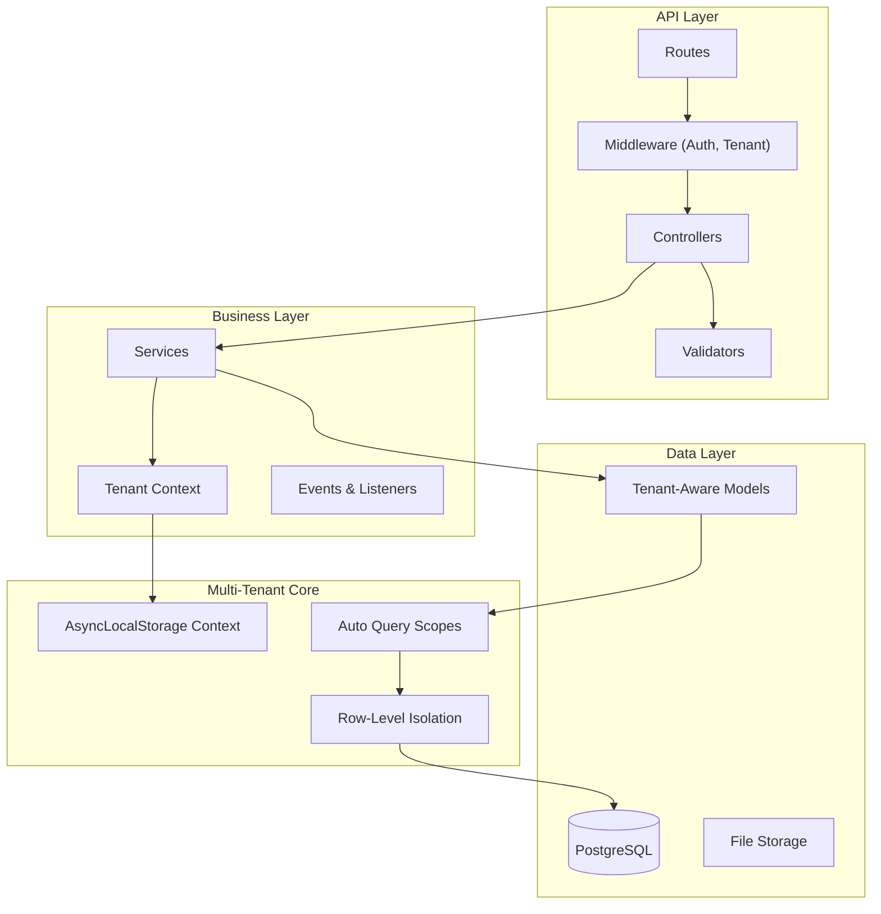

<h1 align="center">
  
</h1>

<p align="center">
  
  
  
  
</p>

<p align="center">
    <a href="README.md">English</a>
    ·
    <a href="README-pt.md">Portuguese</a>
</p>

<p align="center">
  <a href="#bookmark-about">About</a>&nbsp;&nbsp;&nbsp;|&nbsp;&nbsp;&nbsp;
  <a href="#bulb-why-multi-tenant">Why Multi-Tenant</a>&nbsp;&nbsp;&nbsp;|&nbsp;&nbsp;&nbsp;
  <a href="#rocket-quick-start-guide">Quick Start Guide</a>&nbsp;&nbsp;&nbsp;|&nbsp;&nbsp;&nbsp;
  <a href="#computer-technologies">Technologies</a>&nbsp;&nbsp;&nbsp;|&nbsp;&nbsp;&nbsp;
  <a href="#package-installation">Installation</a>&nbsp;&nbsp;&nbsp;|&nbsp;&nbsp;&nbsp;
  <a href="#memo-license">License</a>
</p>

## :bookmark: About

**JuridicAI** is a modern, multi-tenant SaaS platform designed for law firm management. Built with **AdonisJS v6**, it
provides complete data isolation for each tenant (law firm), enabling secure management of clients, legal cases,
deadlines, documents, and team collaboration.

This platform is engineered for scalability and data security. Each law firm operates in a completely isolated
environment with automatic query scoping, preventing any data leakage between tenants. The architecture follows
Brazilian legal domain requirements with built-in CPF/CNPJ validation, CNJ case number formatting, and compliance-ready
audit trails.

### 🏗️ Architecture Overview



## :bulb: Why Multi-Tenant?

### Business Rationale

Multi-tenancy was chosen as the core architectural principle for JuridicAI for several strategic reasons:

**Cost Efficiency** 💰

- Single infrastructure serves multiple law firms
- Shared resources reduce operational costs by ~70%
- Economies of scale benefit all tenants

**Operational Excellence** ⚙️

- One deployment for all tenants
- Centralized updates and maintenance
- Consistent feature rollout

**Scalability** 📈

- Add new law firms without infrastructure changes
- Horizontal scaling benefits all tenants
- Resource pooling optimizes utilization

**Data Security** 🔒

- Complete isolation at the database row level
- Zero data leaks verified by comprehensive tests
- Compliance-ready audit trails per tenant

### Why Row-Level Isolation?

We chose **row-level isolation** (shared database, tenant_id column) over schema-per-tenant or database-per-tenant for:

✅ **Simplicity**: Single migration, easier backups, simpler deployment
✅ **Cost**: No per-tenant database overhead
✅ **Performance**: Optimized with composite indexes (tenant_id, ...)
✅ **Analytics**: Cross-tenant insights for platform improvements
✅ **Proven at Scale**: Works well for 1000+ tenants

## :rocket: Quick Start Guide

### Creating Tenant-Scoped Resources

All models extend `TenantAwareModel` for automatic isolation:

```typescript
// app/models/client.ts
import TenantAwareModel from '#models/tenant_aware_model'
import { column } from '@adonisjs/lucid/orm'

export default class Client extends TenantAwareModel {
  @column({ isPrimary: true })
  declare id: number

  @column()
  declare tenant_id: string // Auto-set on create

  @column()
  declare full_name: string

  @column()
  declare email: string
}
```

### Working with Tenant Context

```typescript
import TenantContextService from '#services/tenants/tenant_context_service'
import Client from '#models/client'

// Execute within tenant context
await TenantContextService.run(
  { tenant_id: 'uuid-here', tenant: null, user_id: null, tenant_user: null },
  async () => {
    // All queries automatically scoped to this tenant
    const client = await Client.create({
      full_name: 'John Doe',
      email: 'john@example.com',
      // tenant_id automatically set!
    })

    // Only returns clients for current tenant
    const allClients = await Client.all()
  }
)
```

### Query Scopes

```typescript
// Automatic scoping (default behavior)
const clients = await Client.all()
// SELECT * FROM clients WHERE tenant_id = 'current-tenant-uuid'

// Manual tenant scoping
const tenant1Clients = await Client.query().apply((scopes) => scopes.forTenant('tenant-1-uuid'))

// Bypass scoping (⚠️ ADMIN ONLY - use with caution)
const allClients = await Client.query().apply((scopes) => scopes.withoutTenantScope())
```

### Testing with Tenants

```typescript
import { test } from '@japa/runner'
import { ClientFactory } from '#database/factories/client_factory'
import { TenantFactory } from '#database/factories/tenant_factory'
import TenantContextService from '#services/tenants/tenant_context_service'

test('client belongs to correct tenant', async ({ assert }) => {
  const tenant = await TenantFactory.create()

  const client = await TenantContextService.run(
    { tenant_id: tenant.id, tenant, user_id: null, tenant_user: null },
    async () => {
      return await ClientFactory.create()
    }
  )

  assert.equal(client.tenant_id, tenant.id)
})
```

## 🌟 Key Features

- **🏢 Row-Level Multi-Tenancy**: Complete data isolation with automatic query scoping via `TenantAwareModel`.
- **⚖️ Brazilian Legal Domain**: CPF/CNPJ validation, CNJ case format (NNNNNNN-DD.AAAA.J.TR.OOOO), court integrations.
- **🔐 AsyncLocalStorage Context**: Tenant context preserved across async operations, including background jobs.
- **📊 Smart Factories**: Generate valid Brazilian legal data (CPF with checksum, realistic CNJ numbers).
- **🔒 Security First**: HttpContext fallback, tenant isolation verified by 33 passing tests.
- **⚡️ Optimized Performance**: Composite indexes (tenant_id, ...), JSONB for flexible metadata.
- **✅ Type-Safe**: Complete TypeScript coverage with snake_case ORM strategy.

## :computer: Technologies

- **[AdonisJS v6](https://adonisjs.com/)**: Modern Node.js framework with first-class TypeScript support.
- **[TypeScript](https://www.typescriptlang.org/)**: Type safety and excellent developer experience.
- **[PostgreSQL](https://www.postgresql.org/)**: Production database with JSONB and advanced indexing.
- **[SQLite](https://www.sqlite.org/)**: Fast in-memory testing database.
- **[VineJS](https://vinejs.dev/)**: Modern, type-safe validation library.
- **[Lucid ORM](https://lucid.adonisjs.com/)**: Elegant ActiveRecord with query scopes.
- **[Japa](https://japa.dev/)**: Delightful testing framework (33 tests passing).

## :package: Installation

### ✔️ Prerequisites

- **Node.js** (v18 or higher)
- **pnpm** (recommended) or npm/yarn
- **PostgreSQL** (v14 or higher)
- **Docker** (optional, for containerized development)

### 🚀 Getting Started

1. **Clone and install:**

   ```bash
   git clone https://github.com/yourusername/juridicai.git
   cd juridicai
   pnpm install
   ```

2. **Environment setup:**

   ```bash
   cp .env.example .env
   ```

   Configure your `.env`:

   ```env
   DB_CONNECTION=postgres
   DB_HOST=localhost
   DB_PORT=5432
   DB_USER=postgres
   DB_PASSWORD=your_password
   DB_DATABASE=juridicai_dev
   ```

3. **Database setup:**

   ```bash
   # Create database
   createdb juridicai_dev

   # Run migrations
   node ace migration:run

   # Seed development data
   node ace db:seed
   ```

4. **Start development:**
   ```bash
   pnpm dev
   ```
   Visit `http://localhost:3333`

### 📜 Available Scripts

```bash
# Development
pnpm dev              # Start with HMR
pnpm build            # Production build
pnpm start            # Run production server

# Testing
pnpm test             # Unit tests (fast)
pnpm test:e2e         # All tests (slower)

# Code Quality
pnpm lint             # ESLint
pnpm lint:fix         # Auto-fix issues
pnpm typecheck        # TypeScript check
pnpm format           # Prettier

# Database
node ace migration:run      # Run migrations
node ace migration:rollback # Rollback
node ace db:seed            # Seed data
```

### 🧪 Development Workflow

Always use AdonisJS Ace commands:

```bash
# Models & Migrations
node ace make:model Client -m

# Controllers
node ace make:controller clients/clients_controller --resource

# Services
node ace make:service clients/create_client_service

# Validators
node ace make:validator CreateClientValidator

# Tests
node ace make:test clients/create_client --suite=functional

# Factories
node ace make:factory Client
```

## 🏗️ Architecture Decisions

### TenantAwareModel Pattern

**Decision**: Use `boot()` method with programmatic hooks instead of decorators.

**Reason**: Abstract class decorators don't work reliably in TypeScript/AdonisJS.

**Implementation**:

```typescript
static
boot()
{
  if (this.booted) return
  super.boot()

  // Auto-set tenant_id on create
  this.before('create', (model) => {
    if (!model.tenant_id) {
      model.tenant_id = TenantContextService.assertTenantId()
    }
  })

  // Auto-scope queries
  this.before('find', (query) => {
    if (!query._skipTenantScope) {
      const tenantId = TenantContextService.getCurrentTenantId()
      if (tenantId) query.where('tenant_id', tenantId)
    }
  })
}
```

### JSONB/ARRAY Handling

**Decision**: Handle both string and object types in `consume` functions.

**Reason**: PostgreSQL returns JSONB as objects, not strings.

**Pattern**:

```typescript
@column({
  prepare: (value: Record<string, any> | null) =>
    value ? JSON.stringify(value) : null,
  consume: (value: string | null) =>
    value ? (typeof value === 'string' ? JSON.parse(value) : value) : null,
})
declare metadata: Record<string, any> | null
```

### HttpContext Fallback

**Decision**: Fallback to `X-Tenant-Id` header when AsyncLocalStorage unavailable.

**Reason**: Background jobs, CLI commands don't have AsyncLocalStorage context.

**Implementation**:

```typescript
getCurrentTenantId(): string | null {
  // Priority 1: AsyncLocalStorage
  const context = this.getContext()
  if (context?.tenant_id) return context.tenant_id

  // Priority 2: HttpContext header
  try {
    const ctx = HttpContext.getOrFail()
    return ctx.request.header('x-tenant-id') ?? null
  } catch {
    return null
  }
}
```

## 🧪 Testing

### Run Tests

```bash
pnpm test       # Unit tests only
pnpm test:e2e   # All tests
```

### Test Coverage (33 passing)

- **TenantContextService** (10 tests): Context isolation, fallback, assertions
- **TenantAwareModel** (7 tests): Auto-scoping, auto-assignment, bypass
- **Multi-tenant isolation** (14 tests): Data leak prevention, cross-tenant queries
- **Legal domain** (2 tests): Client-Case workflow

### Example Test

```typescript
test('prevents cross-tenant data access', async ({ assert }) => {
  const tenant1 = await TenantFactory.create()
  const tenant2 = await TenantFactory.create()

  // Create client for tenant 1
  const client1 = await TenantContextService.run(
    { tenant_id: tenant1.id, tenant: tenant1, user_id: null, tenant_user: null },
    async () => await ClientFactory.create()
  )

  // Query from tenant 2 context
  const result = await TenantContextService.run(
    { tenant_id: tenant2.id, tenant: tenant2, user_id: null, tenant_user: null },
    async () => await Client.find(client1.id)
  )

  assert.isNull(result) // ✅ Tenant 2 cannot see tenant 1's data
})
```

## 🔧 Troubleshooting

### "No tenant ID in current context"

**Cause**: Trying to create/query tenant-scoped resource outside TenantContext.

**Solution**:

```typescript
// ❌ Wrong
const client = await Client.create({full_name: 'John'})

// ✅ Correct
await TenantContextService.run({tenant_id: 'uuid', ...}, async () => {
  const client = await Client.create({full_name: 'John'})
})
```

### JSONB field returns "[object Object]"

**Cause**: Old consume function tries to JSON.parse an already-parsed object.

**Solution**: Use pattern from Architecture Decisions above with `typeof` check.

### Query returns data from wrong tenant

**Cause**: Using `withoutTenantScope()` or missing tenant context.

**Solution**: Ensure TenantContext is set and avoid `withoutTenantScope()` unless absolutely necessary.

## ⚡ Performance & Security

### Indexing Strategy

All tenant-scoped tables use composite indexes:

```sql
CREATE INDEX idx_clients_tenant ON clients (tenant_id);
CREATE INDEX idx_clients_tenant_email ON clients (tenant_id, email);
```

### Security Checklist

- ✅ All models extend `TenantAwareModel`
- ✅ All queries automatically scoped
- ✅ Tenant isolation verified by tests
- ✅ No raw SQL without tenant_id filter
- ✅ HttpContext fallback for requests
- ✅ Admin operations use explicit `withoutTenantScope()`

## :memo: License

This project is licensed under **Proprietary License**. All rights reserved.

---

<p align="center">
  Made with ❤️ using AdonisJS v6 | <a href="https://github.com/yourusername/juridicai/issues">Report Bug</a> | <a href="https://github.com/yourusername/juridicai/pulls">Request Feature</a>
</p>
