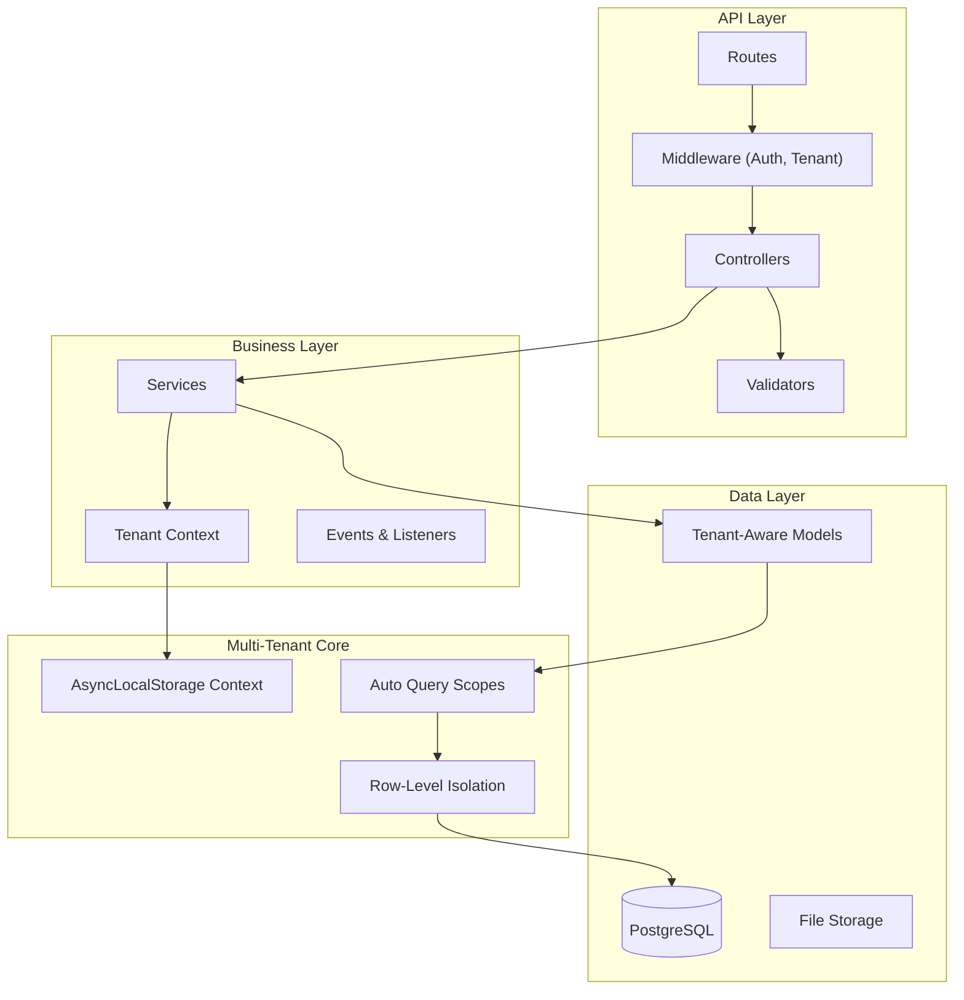

<h1 align="center">
  
</h1>

<p align="center">
  
  
  
  
</p>

<p align="center">
    <a href="README.md">English</a>
    ·
    <a href="README-pt.md">Portuguese</a>
</p>

<p align="center">
  <a href="#bookmark-about">About</a>&nbsp;&nbsp;&nbsp;|&nbsp;&nbsp;&nbsp;
  <a href="#rocket-multi-tenant-first">Multi-Tenant First</a>&nbsp;&nbsp;&nbsp;|&nbsp;&nbsp;&nbsp;
  <a href="#computer-technologies">Technologies</a>&nbsp;&nbsp;&nbsp;|&nbsp;&nbsp;&nbsp;
  <a href="#package-installation">Installation</a>&nbsp;&nbsp;&nbsp;|&nbsp;&nbsp;&nbsp;
  <a href="#memo-license">License</a>
</p>

## :bookmark: About

**JuridicAI** is a modern, multi-tenant SaaS platform designed for law firm management. Built with **AdonisJS v6**, it provides complete data isolation for each tenant (law firm), enabling secure management of clients, legal cases, deadlines, documents, and team collaboration.

This platform is engineered for scalability and data security. Each law firm operates in a completely isolated environment with automatic query scoping, preventing any data leakage between tenants. The architecture follows Brazilian legal domain requirements with built-in CPF/CNPJ validation, CNJ case number formatting, and compliance-ready audit trails.

### 🏗️ Architecture Overview



## :rocket: Multi-Tenant First

This platform is uniquely designed with multi-tenancy as a core architectural principle, not an afterthought.

- **Zero Data Leaks**: Automatic tenant scoping at the ORM level ensures queries never cross tenant boundaries. Verified by comprehensive test suite.
- **Brazilian Legal Domain**: Built-in validation for CPF/CNPJ, CNJ case number format, and Brazilian court system integration patterns.
- **Tenant Context Isolation**: Uses AsyncLocalStorage to maintain tenant context throughout the entire request lifecycle, including background jobs.
- **Type-Safe Multi-Tenancy**: Complete TypeScript coverage ensures tenant_id is always present and correctly typed across all tenant-scoped operations.

## 🌟 Key Features

- **🏢 Multi-Tenant Architecture**: Row-level isolation with automatic query scoping via TenantAwareModel base class.
- **⚖️ Legal Domain Models**: Clients, Cases, Deadlines, Documents, Events - all following Brazilian legal standards.
- **🇧🇷 Brazilian Specifics**: CPF/CNPJ validation algorithms, CNJ case format, court integrations (PJe, e-SAJ).
- **📊 Factory System**: Brazilian-aware test data generators with valid CPF/CNPJ and realistic legal case data.
- **🔒 Secure by Default**: Tenant isolation verified by 33 passing tests covering all isolation scenarios.
- **⚡️ High Performance**: Optimized indexes for multi-tenant queries, JSONB for flexible metadata.
- **✅ Type-Safe**: Complete TypeScript coverage with snake_case ORM naming strategy.

## :computer: Technologies

- **[AdonisJS v6](https://adonisjs.com/)**: A robust Node.js framework for the backend.
- **[TypeScript](https://www.typescriptlang.org/)**: For type safety across the entire platform.
- **[PostgreSQL](https://www.postgresql.org/)**: Production database with JSONB support for flexible schemas.
- **[SQLite](https://www.sqlite.org/)**: Lightweight database for fast testing.
- **[VineJS](https://vinejs.dev/)**: Modern validation library for request data.
- **[Lucid ORM](https://lucid.adonisjs.com/)**: Elegant ActiveRecord with multi-tenant query scopes.
- **[Japa](https://japa.dev/)**: Modern testing framework (33 tests passing).

## :package: Installation

### ✔️ Prerequisites

- **Node.js** (v18 or higher)
- **pnpm** (or npm/yarn)
- **PostgreSQL** (v14 or higher)
- **Docker** (optional, for containerized database)

### 🚀 Getting Started

1. **Clone the repository:**

   ```sh
   git clone https://github.com/yourusername/juridicai.git
   cd juridicai
   ```

2. **Install dependencies:**

   ```sh
   pnpm install
   ```

3. **Setup environment variables:**

   ```sh
   cp .env.example .env
   ```

   _Open the `.env` file and configure your database credentials and other settings._

4. **Run database migrations:**

   ```sh
   node ace migration:run
   ```

5. **Seed development data:**

   ```sh
   node ace db:seed
   ```

6. **Start the development server:**
   ```sh
   pnpm dev
   ```
   _Your API will be available at `http://localhost:3333`._

### 📜 Available Scripts

- `pnpm dev`: Starts the development server with HMR.
- `pnpm build`: Compiles the application for production.
- `pnpm start`: Runs the production-ready server.
- `pnpm test`: Executes unit tests.
- `pnpm test:e2e`: Executes end-to-end tests.
- `pnpm lint`: Lints the codebase.
- `pnpm lint:fix`: Fixes linting issues automatically.
- `pnpm format`: Formats the code with Prettier.
- `pnpm typecheck`: Runs TypeScript type checking.

### 🧪 Development Workflow

Always use AdonisJS Ace commands to maintain consistency:

```bash
# Create models with migrations
node ace make:model Client -m

# Create controllers
node ace make:controller clients/clients_controller --resource

# Create services
node ace make:service clients/create_client_service

# Create validators
node ace make:validator CreateClientValidator

# Create tests
node ace make:test clients/create_client --suite=functional

# Create factories
node ace make:factory Client
```

## :memo: License

This project is licensed under **Proprietary License**. All rights reserved.

---

<p align="center">
  Made with ❤️ using AdonisJS v6
</p>
