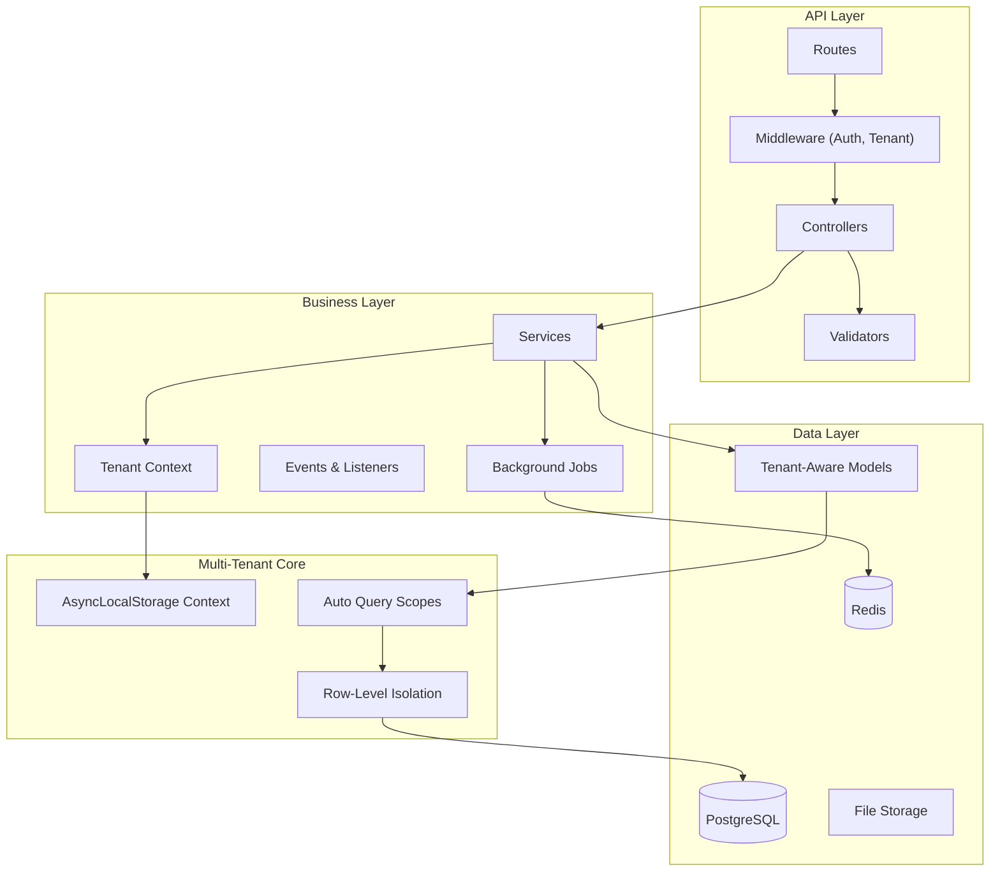

<h1 align="center">
  
</h1>

<p align="center">
  
  
  
  
  
</p>

<p align="center">
    <a href="README.md">English</a>
    ·
    <a href="README-pt.md">Portuguese</a>
</p>

<p align="center">
  <a href="#bookmark-about">About</a>&nbsp;&nbsp;&nbsp;|&nbsp;&nbsp;&nbsp;
  <a href="#bulb-why-multi-tenant">Why Multi-Tenant</a>&nbsp;&nbsp;&nbsp;|&nbsp;&nbsp;&nbsp;
  <a href="#rocket-quick-start-guide">Quick Start Guide</a>&nbsp;&nbsp;&nbsp;|&nbsp;&nbsp;&nbsp;
  <a href="#computer-technologies">Technologies</a>&nbsp;&nbsp;&nbsp;|&nbsp;&nbsp;&nbsp;
  <a href="#package-installation">Installation</a>&nbsp;&nbsp;&nbsp;|&nbsp;&nbsp;&nbsp;
  <a href="#wrench-configuration">Configuration</a>&nbsp;&nbsp;&nbsp;|&nbsp;&nbsp;&nbsp;
  <a href="#file_folder-project-structure">Project Structure</a>&nbsp;&nbsp;&nbsp;|&nbsp;&nbsp;&nbsp;
  <a href="#memo-license">License</a>
</p>

## :bookmark: About

**JuridicAI** is a modern, multi-tenant SaaS platform designed for law firm management. Built with **AdonisJS v6**, it
provides complete data isolation for each tenant (law firm), enabling secure management of clients, legal cases,
deadlines, documents, and team collaboration.

This platform is engineered for scalability and data security. Each law firm operates in a completely isolated
environment with automatic query scoping, preventing any data leakage between tenants. The architecture follows
Brazilian legal domain requirements with built-in CPF/CNPJ validation, CNJ case number formatting, and compliance-ready
audit trails.

### 🏗️ Architecture Overview



## :bulb: Why Multi-Tenant?

### Business Rationale

Multi-tenancy was chosen as the core architectural principle for JuridicAI for several strategic reasons:

**Cost Efficiency** 💰

- Single infrastructure serves multiple law firms
- Shared resources reduce operational costs by ~70%
- Economies of scale benefit all tenants

**Operational Excellence** ⚙️

- One deployment for all tenants
- Centralized updates and maintenance
- Consistent feature rollout

**Scalability** 📈

- Add new law firms without infrastructure changes
- Horizontal scaling benefits all tenants
- Resource pooling optimizes utilization

**Data Security** 🔒

- Complete isolation at the database row level
- Zero data leaks verified by comprehensive tests
- Compliance-ready audit trails per tenant

### Why Row-Level Isolation?

We chose **row-level isolation** (shared database, tenant_id column) over schema-per-tenant or database-per-tenant for:

✅ **Simplicity**: Single migration, easier backups, simpler deployment
✅ **Cost**: No per-tenant database overhead
✅ **Performance**: Optimized with composite indexes (tenant_id, ...)
✅ **Analytics**: Cross-tenant insights for platform improvements
✅ **Proven at Scale**: Works well for 1000+ tenants

## :rocket: Quick Start Guide

### Creating Tenant-Scoped Resources

All models extend `TenantAwareModel` for automatic isolation:

```typescript
// app/models/client.ts
import TenantAwareModel from '#models/tenant_aware_model'
import { column } from '@adonisjs/lucid/orm'

export default class Client extends TenantAwareModel {
  @column({ isPrimary: true })
  declare id: number

  @column()
  declare tenant_id: string // Auto-set on create

  @column()
  declare full_name: string

  @column()
  declare email: string
}
```

### Working with Tenant Context

```typescript
import TenantContextService from '#services/tenants/tenant_context_service'
import Client from '#models/client'

// Execute within tenant context
await TenantContextService.run(
  { tenant_id: 'uuid-here', tenant: null, user_id: null, tenant_user: null },
  async () => {
    // All queries automatically scoped to this tenant
    const client = await Client.create({
      full_name: 'John Doe',
      email: 'john@example.com',
      // tenant_id automatically set!
    })

    // Only returns clients for current tenant
    const allClients = await Client.all()
  }
)
```

### Query Scopes

```typescript
// Automatic scoping (default behavior)
const clients = await Client.all()
// SELECT * FROM clients WHERE tenant_id = 'current-tenant-uuid'

// Manual tenant scoping
const tenant1Clients = await Client.query().apply((scopes) => scopes.forTenant('tenant-1-uuid'))

// Bypass scoping (⚠️ ADMIN ONLY - use with caution)
const allClients = await Client.query().apply((scopes) => scopes.withoutTenantScope())
```

### Testing with Tenants

```typescript
import { test } from '@japa/runner'
import { ClientFactory } from '#database/factories/client_factory'
import { TenantFactory } from '#database/factories/tenant_factory'
import TenantContextService from '#services/tenants/tenant_context_service'

test('client belongs to correct tenant', async ({ assert }) => {
  const tenant = await TenantFactory.create()

  const client = await TenantContextService.run(
    { tenant_id: tenant.id, tenant, user_id: null, tenant_user: null },
    async () => {
      return await ClientFactory.create()
    }
  )

  assert.equal(client.tenant_id, tenant.id)
})
```

## 🌟 Key Features

- **🏢 Row-Level Multi-Tenancy**: Complete data isolation with automatic query scoping via `TenantAwareModel`.
- **⚖️ Brazilian Legal Domain**: CPF/CNPJ validation, CNJ case format (NNNNNNN-DD.AAAA.J.TR.OOOO), court integrations.
- **🔐 AsyncLocalStorage Context**: Tenant context preserved across async operations, including background jobs.
- **📊 Smart Factories**: Generate valid Brazilian legal data (CPF with checksum, realistic CNJ numbers).
- **🔒 Security First**: HttpContext fallback, tenant isolation verified by comprehensive tests.
- **⚡️ Optimized Performance**: Composite indexes (tenant_id, ...), JSONB for flexible metadata.
- **✅ Type-Safe**: Complete TypeScript coverage with snake_case ORM strategy.
- **🌐 Internationalization**: Multi-language support via AdonisJS i18n.
- **📦 Background Jobs**: Bull Queue integration for async task processing.
- **☁️ Flexible Storage**: Support for local filesystem, AWS S3, and Google Cloud Storage.

## :computer: Technologies

### Core Stack

- **[AdonisJS v6](https://adonisjs.com/)** (v6.19.0): Modern Node.js framework with first-class TypeScript support.
- **[TypeScript](https://www.typescriptlang.org/)** (v5.9): Type safety and excellent developer experience.
- **[Node.js](https://nodejs.org/)** (v18+): JavaScript runtime.
- **[pnpm](https://pnpm.io/)**: Fast, disk space efficient package manager.

### Database & Caching

- **[PostgreSQL](https://www.postgresql.org/)** (v14+): Production database with JSONB and advanced indexing.
- **[SQLite](https://www.sqlite.org/)**: Fast in-memory testing database.
- **[Lucid ORM](https://lucid.adonisjs.com/)** (v21.8): Elegant ActiveRecord with query scopes.
- **[Redis](https://redis.io/)**: Caching and session storage.

### Authentication & Security

- **[Argon2](https://github.com/ranisalt/node-argon2)**: Password hashing.
- **[@adonisjs/auth](https://docs.adonisjs.com/guides/auth)**: Authentication system.
- **[@adonisjs/shield](https://docs.adonisjs.com/guides/security/shield)**: Security middleware (CSRF, CSP, etc.).
- **[@adonisjs/cors](https://docs.adonisjs.com/guides/security/cors)**: CORS configuration.
- **[@adonisjs/limiter](https://docs.adonisjs.com/guides/security/rate-limiting)**: Rate limiting.

### Background Processing & Queue

- **[@rlanz/bull-queue](https://github.com/Rlanz/bull-queue)**: Background job processing with Bull.

### File Storage

- **[@adonisjs/drive](https://docs.adonisjs.com/guides/drive)**: Unified file storage API.
- **[@aws-sdk/client-s3](https://www.npmjs.com/package/@aws-sdk/client-s3)**: AWS S3 integration.
- **[@google-cloud/storage](https://www.npmjs.com/package/@google-cloud/storage)**: Google Cloud Storage integration.

### Validation & Templating

- **[VineJS](https://vinejs.dev/)** (v3.0): Modern, type-safe validation library.
- **[Edge.js](https://edgejs.dev/)**: Template engine for server-side rendering.

### Testing

- **[Japa](https://japa.dev/)** (v4.4): Delightful testing framework.
- **[@japa/api-client](https://japa.dev/plugins/api-client)**: HTTP API testing.
- **[@japa/assert](https://japa.dev/plugins/assert)**: Assertions library.
- **[@japa/openapi-assertions](https://www.npmjs.com/package/@japa/openapi-assertions)**: OpenAPI/Swagger validation.

### Development Tools

- **[ESLint](https://eslint.org/)**: Code linting with AdonisJS config.
- **[Prettier](https://prettier.io/)**: Code formatting.
- **[@swc/core](https://swc.rs/)**: Fast TypeScript/JavaScript compiler.
- **[hot-hook](https://www.npmjs.com/package/hot-hook)**: Hot module reloading.

## :package: Installation

### ✔️ Prerequisites

- **Node.js** (v18 or higher)
- **pnpm** (recommended) or npm/yarn
- **PostgreSQL** (v14 or higher)
- **Redis** (for caching and queue management)
- **Docker** (optional, for containerized development)

### 🚀 Getting Started

1. **Clone and install:**

   ```bash
   git clone https://github.com/gabrielmaialva33/juridicai.git
   cd juridicai
   pnpm install
   ```

2. **Environment setup:**

   ```bash
   cp .env.example .env
   ```

   **⚠️ IMPORTANT**: Generate APP_KEY before running:

   ```bash
   node ace generate:key
   ```

   This command will generate a secure encryption key and update your `.env` file.

3. **Database setup:**

   ```bash
   # Create database
   createdb juridicai_dev

   # Run migrations
   node ace migration:run

   # Seed development data (optional)
   node ace db:seed
   ```

4. **Start Redis:**

   ```bash
   # Using Docker
   docker run -d -p 6379:6379 redis:alpine

   # Or install and start Redis locally
   redis-server
   ```

5. **Start development:**
   ```bash
   pnpm dev
   ```
   Visit `http://localhost:3333`

### 📜 Available Scripts

```bash
# Development
pnpm dev              # Start with HMR (Hot Module Reload)
pnpm start            # Run production server (requires build)
pnpm build            # Build for production (output: ./build)

# Testing
pnpm test             # Run unit tests only (fast)
pnpm test:e2e         # Run all tests (unit + functional)

# Code Quality
pnpm lint             # Run ESLint
pnpm lint:fix         # Auto-fix ESLint issues
pnpm format           # Format code with Prettier
pnpm typecheck        # TypeScript type checking

# Database
node ace migration:run        # Run pending migrations
node ace migration:rollback   # Rollback last batch
node ace migration:status     # Check migration status
node ace db:seed              # Run database seeders

# Docker
pnpm docker           # Run migrations, seed, and start server
```

### 🧪 Development Workflow

Always use AdonisJS Ace commands:

```bash
# Models & Migrations
node ace make:model Client -m

# Controllers
node ace make:controller clients/clients_controller --resource

# Services
node ace make:service clients/create_client_service

# Validators
node ace make:validator CreateClientValidator

# Tests
node ace make:test clients/create_client --suite=functional

# Factories
node ace make:factory Client

# Background Jobs
node ace make:job SendEmailJob
```

## :wrench: Configuration

### Environment Variables

Configure your `.env` file with the following variables:

#### Application

```env
TZ=UTC                          # Timezone
PORT=3333                       # Server port
HOST=localhost                  # Server host
LOG_LEVEL=info                  # Log level (trace, debug, info, warn, error, fatal)
APP_KEY=                        # Encryption key (generate with: node ace generate:key)
NODE_ENV=development            # Environment (development, production, test)
```

#### Session & Storage

```env
SESSION_DRIVER=cookie           # Session driver (cookie, redis, file)
LIMITER_STORE=database          # Rate limiter store (database, redis)
DRIVE_DISK=fs                   # Default storage disk (fs, s3, gcs)
```

#### Database

```env
DB_CONNECTION=postgres          # Database driver (postgres, sqlite)
DB_HOST=localhost               # Database host
DB_PORT=5432                    # Database port
DB_USER=postgres                # Database username
DB_PASSWORD=your_password       # Database password
DB_DATABASE=juridicai_dev       # Database name
```

#### Redis

```env
REDIS_HOST=127.0.0.1            # Redis host
REDIS_PORT=6379                 # Redis port
REDIS_PASSWORD=                 # Redis password (if required)
```

#### Mail Configuration

```env
MAIL_MAILER=mailgun             # Mail provider (mailgun, smtp)
MAIL_FROM_ADDRESS=noreply@example.com
MAIL_FROM_NAME="JuridicAI"
```

**Option 1: Mailgun**

```env
MAILGUN_API_KEY=your-mailgun-api-key
MAILGUN_DOMAIN=your-mailgun-domain
MAILGUN_BASE_URL=https://api.mailgun.net/v3
```

**Option 2: SMTP**

```env
SMTP_HOST=smtp.example.com
SMTP_PORT=587
SMTP_USER=your-smtp-username
SMTP_PASS=your-smtp-password
```

#### Cloud Storage (Optional)

**AWS S3:**

```env
S3_KEY=your-aws-access-key
S3_SECRET=your-aws-secret-key
S3_BUCKET=your-bucket-name
S3_REGION=us-east-1
S3_ENDPOINT=                    # Optional: Custom S3-compatible endpoint
```

**Google Cloud Storage:**

```env
GCS_KEY_FILENAME=path/to/service-account.json
GCS_BUCKET=your-bucket-name
```

### Configuration Files

Configuration files are located in the `config/` directory:

- `app.ts` - Application settings
- `auth.ts` - Authentication configuration
- `bodyparser.ts` - Request body parsing
- `cache.ts` - Cache configuration
- `cors.ts` - CORS settings
- `database.ts` - Database connections
- `drive.ts` - File storage
- `hash.ts` - Password hashing
- `limiter.ts` - Rate limiting
- `logger.ts` - Logging configuration
- `mail.ts` - Email configuration
- `redis.ts` - Redis configuration
- `session.ts` - Session management
- `shield.ts` - Security middleware
- `static.ts` - Static file serving

## :file_folder: Project Structure

```
juridicai/
├── app/                        # Application code
│   ├── controllers/           # HTTP controllers (organized by domain)
│   ├── events/                # Event definitions
│   ├── exceptions/            # Custom exceptions
│   ├── extensions/            # Framework extensions
│   ├── interfaces/            # TypeScript interfaces
│   ├── middleware/            # HTTP middleware
│   ├── models/                # Database models (Lucid ORM)
│   ├── repositories/          # Data access layer
│   ├── routes/                # Route definitions
│   ├── services/              # Business logic services
│   ├── shared/                # Shared utilities
│   └── validators/            # Request validators (VineJS)
├── bin/                       # Entry point scripts
│   └── server.js             # HTTP server entry point
├── commands/                  # Custom Ace commands
├── config/                    # Configuration files
├── database/                  # Database related files
│   ├── factories/            # Model factories for testing
│   ├── migrations/           # Database migrations
│   └── seeders/              # Database seeders
├── docs/                      # Project documentation
├── providers/                 # Service providers
├── resources/                 # Frontend resources
│   ├── lang/                 # i18n translation files
│   └── views/                # Edge.js templates
├── start/                     # Application bootstrap
│   ├── kernel.ts             # Middleware registration
│   └── routes.ts             # Route registration
├── storage/                   # File storage (local)
│   └── uploads/              # Uploaded files
├── tests/                     # Test files
│   ├── functional/           # Functional/E2E tests
│   ├── unit/                 # Unit tests
│   ├── utils/                # Test utilities
│   └── bootstrap.ts          # Test configuration
├── tmp/                       # Temporary files
├── types/                     # TypeScript type definitions
├── .env.example              # Environment variables template
├── .env.test                 # Test environment variables
├── ace.js                    # Ace CLI entry point
├── adonisrc.ts               # AdonisJS configuration
├── package.json              # Dependencies and scripts
├── tsconfig.json             # TypeScript configuration
└── README.md                 # This file
```

### Import Aliases

The project uses `#` prefix for clean imports:

```typescript
import User from '#models/user'
import TenantContextService from '#services/tenants/tenant_context_service'
import { HttpContext } from '@adonisjs/core/http'
```

Available aliases:

- `#controllers/*` → `./app/controllers/*.js`
- `#models/*` → `./app/models/*.js`
- `#services/*` → `./app/services/*.js`
- `#middleware/*` → `./app/middleware/*.js`
- `#validators/*` → `./app/validators/*.js`
- `#repositories/*` → `./app/repositories/*.js`
- `#policies/*` → `./app/policies/*.js`
- `#abilities/*` → `./app/abilities/*.js`
- `#providers/*` → `./providers/*.js`
- `#routes/*` → `./app/routes/*.js`
- `#database/*` → `./database/*.js`
- `#tests/*` → `./tests/*.js`
- `#start/*` → `./start/*.js`
- `#config/*` → `./config/*.js`
- `#shared/*` → `./app/shared/*.js`
- `#events/*` → `./app/events/*.js`
- `#exceptions/*` → `./app/exceptions/*.js`
- `#extensions/*` → `./app/extensions/*.js`
- `#interfaces/*` → `./app/interfaces/*.js`
- `#listeners/*` → `./app/listeners/*.js`
- `#mails/*` → `./app/mails/*.js`

## 🏗️ Architecture Decisions

### TenantAwareModel Pattern

**Decision**: Use `boot()` method with programmatic hooks instead of decorators.

**Reason**: Abstract class decorators don't work reliably in TypeScript/AdonisJS.

**Implementation**:

```typescript
static boot() {
  if (this.booted) return
  super.boot()

  // Auto-set tenant_id on create
  this.before('create', (model) => {
    if (!model.tenant_id) {
      model.tenant_id = TenantContextService.assertTenantId()
    }
  })

  // Auto-scope queries
  this.before('find', (query) => {
    if (!query._skipTenantScope) {
      const tenantId = TenantContextService.getCurrentTenantId()
      if (tenantId) query.where('tenant_id', tenantId)
    }
  })
}
```

### JSONB/ARRAY Handling

**Decision**: Handle both string and object types in `consume` functions.

**Reason**: PostgreSQL returns JSONB as objects, not strings.

**Pattern**:

```typescript
@column({
  prepare: (value: Record<string, any> | null) =>
    value ? JSON.stringify(value) : null,
  consume: (value: string | null) =>
    value ? (typeof value === 'string' ? JSON.parse(value) : value) : null,
})
declare metadata: Record<string, any> | null
```

### HttpContext Fallback

**Decision**: Fallback to `X-Tenant-Id` header when AsyncLocalStorage unavailable.

**Reason**: Background jobs, CLI commands don't have AsyncLocalStorage context.

**Implementation**:

```typescript
getCurrentTenantId(): string | null {
  // Priority 1: AsyncLocalStorage
  const context = this.getContext()
  if (context?.tenant_id) return context.tenant_id

  // Priority 2: HttpContext header
  try {
    const ctx = HttpContext.getOrFail()
    return ctx.request.header('x-tenant-id') ?? null
  } catch {
    return null
  }
}
```

## 🧪 Testing

### Run Tests

```bash
pnpm test       # Unit tests only (fast, ~2s timeout)
pnpm test:e2e   # All tests (unit + functional, ~30s timeout)
```

### Test Organization

Tests are organized into two suites:

- **Unit tests**: `tests/unit/**/*.spec.ts` (timeout: 2s)
- **Functional tests**: `tests/functional/**/*.spec.ts` (timeout: 30s)

### Test Coverage

> **TODO**: Run `pnpm test:e2e` to get the exact test count and update this section.

The test suite includes:

- **TenantContextService**: Context isolation, fallback mechanisms, assertions
- **TenantAwareModel**: Auto-scoping, auto-assignment, bypass operations
- **Multi-tenant isolation**: Data leak prevention, cross-tenant query validation
- **Legal domain**: Client-Case workflow, Brazilian legal validations
- **API endpoints**: CRUD operations, authentication, authorization
- **Background jobs**: Queue processing, tenant context preservation

### Example Test

```typescript
test('prevents cross-tenant data access', async ({ assert }) => {
  const tenant1 = await TenantFactory.create()
  const tenant2 = await TenantFactory.create()

  // Create client for tenant 1
  const client1 = await TenantContextService.run(
    { tenant_id: tenant1.id, tenant: tenant1, user_id: null, tenant_user: null },
    async () => await ClientFactory.create()
  )

  // Query from tenant 2 context
  const result = await TenantContextService.run(
    { tenant_id: tenant2.id, tenant: tenant2, user_id: null, tenant_user: null },
    async () => await Client.find(client1.id)
  )

  assert.isNull(result) // ✅ Tenant 2 cannot see tenant 1's data
})
```

### Writing Tests

**Test file naming convention:** `*.spec.ts`

**Basic test structure:**

```typescript
import { test } from '@japa/runner'

test.group('Feature Name', () => {
  test('should perform expected behavior', ({ assert }) => {
    const result = 2 + 2
    assert.equal(result, 4)
  })

  test('should handle async operations', async ({ assert }) => {
    const result = await someAsyncFunction()
    assert.isTrue(result)
  })
})
```

## 🔧 Troubleshooting

### "No tenant ID in current context"

**Cause**: Trying to create/query tenant-scoped resource outside TenantContext.

**Solution**:

```typescript
// ❌ Wrong
const client = await Client.create({full_name: 'John'})

// ✅ Correct
await TenantContextService.run({tenant_id: 'uuid', ...}, async () => {
  const client = await Client.create({full_name: 'John'})
})
```

### JSONB field returns "[object Object]"

**Cause**: Old consume function tries to JSON.parse an already-parsed object.

**Solution**: Use pattern from Architecture Decisions above with `typeof` check.

### Query returns data from wrong tenant

**Cause**: Using `withoutTenantScope()` or missing tenant context.

**Solution**: Ensure TenantContext is set and avoid `withoutTenantScope()` unless absolutely necessary.

### APP_KEY not set error

**Cause**: Missing or empty APP_KEY in `.env`.

**Solution**:

```bash
node ace generate:key
```

### Database connection errors

**Symptoms**: Cannot connect to database, migrations fail.

**Solutions**:

1. Verify PostgreSQL is running: `pg_isready`
2. Check `.env` database credentials
3. Ensure database exists: `createdb juridicai_dev`
4. Test connection: `psql -U postgres -d juridicai_dev`

### Redis connection errors

**Symptoms**: Cache or session errors, queue jobs not processing.

**Solutions**:

1. Verify Redis is running: `redis-cli ping`
2. Check `REDIS_HOST` and `REDIS_PORT` in `.env`
3. Start Redis: `redis-server` or `docker run -d -p 6379:6379 redis:alpine`

### Migration errors

**Symptoms**: Migration fails or creates inconsistent state.

**Solutions**:

1. Check migration order and dependencies
2. Reset database: `node ace migration:rollback --batch=0 && node ace migration:run`
3. Review migration file for SQL errors
4. Ensure database user has CREATE/ALTER permissions

### Test failures

**Symptoms**: Tests fail unexpectedly or timeout.

**Solutions**:

1. Ensure `.env.test` is configured
2. Check test database exists and is accessible
3. Run migrations in test environment: `NODE_ENV=test node ace migration:run`
4. Clear test database: `NODE_ENV=test node ace migration:rollback --batch=0`
5. Increase timeout for slow tests in `adonisrc.ts`

## ⚡ Performance & Security

### Indexing Strategy

All tenant-scoped tables use composite indexes:

```sql
CREATE INDEX idx_clients_tenant ON clients (tenant_id);
CREATE INDEX idx_clients_tenant_email ON clients (tenant_id, email);
CREATE INDEX idx_cases_tenant_status ON cases (tenant_id, status);
```

### Security Checklist

- ✅ All models extend `TenantAwareModel`
- ✅ All queries automatically scoped
- ✅ Tenant isolation verified by tests
- ✅ No raw SQL without tenant_id filter
- ✅ HttpContext fallback for requests
- ✅ Admin operations use explicit `withoutTenantScope()`
- ✅ CSRF protection enabled (Shield)
- ✅ Rate limiting configured (Limiter)
- ✅ CORS properly configured
- ✅ Passwords hashed with Argon2
- ✅ SQL injection prevention via Lucid ORM
- ✅ XSS protection in Edge templates

### Performance Tips

1. **Use query scopes efficiently**:

   ```typescript
   // Good: Use specific queries
   const activeClients = await Client.query().where('status', 'active')

   // Avoid: Loading all data and filtering in memory
   const allClients = await Client.all()
   const activeClients = allClients.filter((c) => c.status === 'active')
   ```

2. **Leverage Redis caching**:

   ```typescript
   import cache from '@adonisjs/cache/services/main'

   const cachedData = await cache.remember('key', 3600, async () => {
     return await expensiveOperation()
   })
   ```

3. **Use background jobs for heavy tasks**:

   ```typescript
   import { Queue } from '@rlanz/bull-queue'

   await Queue.dispatch('SendEmailJob', { userId: 123 })
   ```

4. **Preload relationships to avoid N+1 queries**:

   ```typescript
   // Good: Eager loading
   const cases = await Case.query().preload('client').preload('documents')

   // Avoid: N+1 queries
   const cases = await Case.all()
   for (const case of cases) {
     await case.load('client') // Separate query for each case!
   }
   ```

## 🤝 Contributing

> **TODO**: Add CONTRIBUTING.md with guidelines for code contributions, PR process, and coding standards.

## 📝 Changelog

See [CHANGELOG.md](CHANGELOG.md) for version history and release notes.

## :memo: License

This project is licensed under **Proprietary License**. All rights reserved.

Copyright (c) 2025 Gabriel Maia <gabrielmaialva33@gmail.com>

See [LICENSE](LICENSE) file for full license text.

---

<p align="center">
  Made with ❤️ using AdonisJS v6 | <a href="https://github.com/gabrielmaialva33/juridicai/issues">Report Bug</a> | <a href="https://github.com/gabrielmaialva33/juridicai/pulls">Request Feature</a>
</p>
