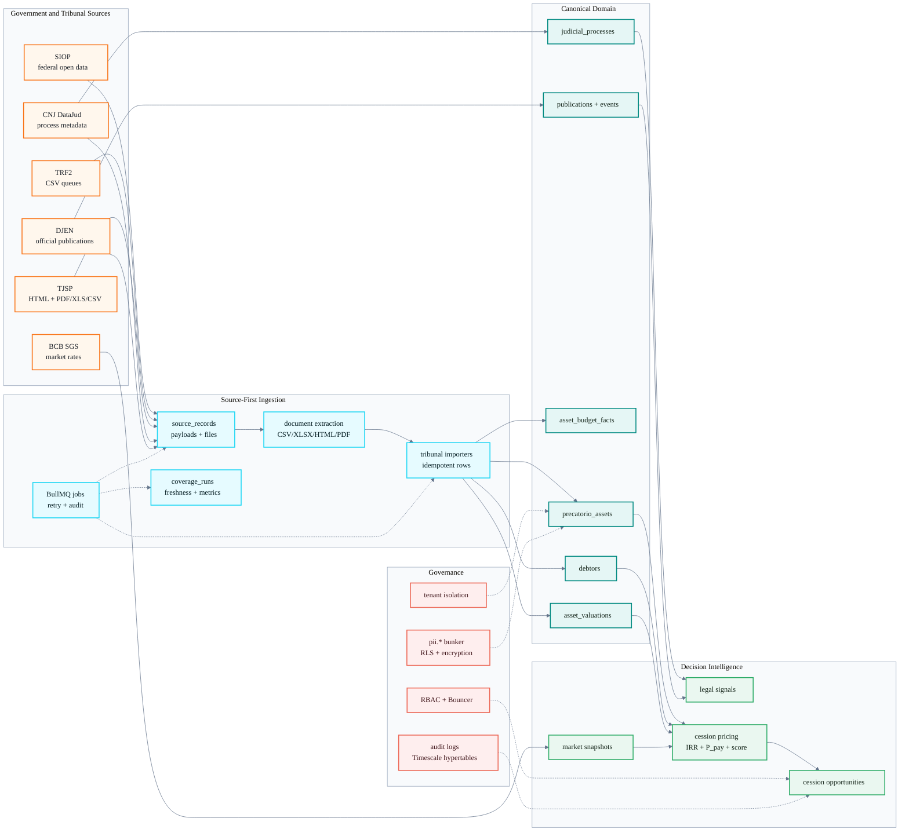

<div align="center">


**From scattered public records to auditable precatório opportunities.**

<p>
  <a href="https://adonisjs.com/"></a>
  <a href="https://react.dev/"></a>
  <a href="https://docs.timescale.com/"></a>
  <a href="https://docs.bullmq.io/"></a>
  <a href="./docs/superpowers/specs/2026-04-28-radar-federal-base-design.md"></a>
  <a href="./package.json"></a>
</p>

---

_"The desk should answer in seconds: originate, price, contact, monitor, block, or discard."_

</div>

---

> [!IMPORTANT]
> **Operations-first legal intelligence.** JuridicAI is an origination and decision desk for precatório opportunities. It collects public government records, preserves provenance, normalizes legal assets, enriches lawsuits, detects publication signals, prices liquidity, and keeps every decision auditable.

> [!NOTE]
> **Designed for real Brazilian data.** The backend already handles federal, judicial, publication, and tribunal-file lanes: SIOP open data, CNJ DataJud, DJEN, TRF2 CSVs, TJSP communications/documents, BCB market rates, and tenant-scoped operational workflows.

---

## Quick Start

```bash
# Install dependencies
pnpm install

# Create local environment
cp .env.example .env
node ace generate:key

# Start TimescaleDB/PostgreSQL 17 and Redis
docker compose up -d

# Prepare the database
node ace migration:run

# Run the Adonis + Inertia development server
pnpm dev

# Run workers when testing async jobs
pnpm worker
```

The default app URL is `http://localhost:3333`. Local services bind to `127.0.0.1:5432` for PostgreSQL and `127.0.0.1:6379` for Redis.

---

## What It Does

| Layer | Purpose | Current sources |
| :-- | :-- | :-- |
| **Discovery** | Finds public precatório datasets, files, communications, and process records. | SIOP, TRF2, TJSP, DataJud, DJEN |
| **Evidence** | Stores source files and API payloads before touching domain tables. | `source_records`, `asset_source_links`, `external_identifiers` |
| **Normalization** | Converts messy rows into canonical assets, debtors, valuations, processes, publications, and events. | CSV, XLSX, HTML, PDF text extraction |
| **Signals** | Detects legal and publication events that change risk or liquidity. | DataJud movements, DJEN/publication text |
| **Pricing** | Builds offer and IRR snapshots from market rates, debtor reliability, term, costs, and legal risk. | BCB SGS CDI/SELIC/IPCA, EC 136 rules |
| **Operations** | Turns assets into an actionable inbox and cession pipeline. | A+ inbox, Kanban pipeline, pricing calculator |

---

## Architecture


```mermaid
%%{init: {'theme': 'base', 'themeVariables': {
  'fontFamily': 'ui-monospace, SFMono-Regular, Menlo, Consolas, monospace',
  'lineColor': '#64748b',
  'primaryTextColor': '#111827',
  'clusterBkg': '#f8fafc',
  'clusterBorder': '#94a3b8'
}}}%%
flowchart LR
    subgraph Sources["Government and Tribunal Sources"]
        SIOP["SIOP<br/>federal open data"]
        TRF2["TRF2<br/>CSV queues"]
        TJSP["TJSP<br/>HTML + PDF/XLS/CSV"]
        DATAJUD["CNJ DataJud<br/>process metadata"]
        DJEN["DJEN<br/>official publications"]
        BCB["BCB SGS<br/>market rates"]
    end

    subgraph Ingestion["Source-First Ingestion"]
        RECORDS["source_records<br/>payloads + files"]
        EXTRACT["document extraction<br/>CSV/XLSX/HTML/PDF"]
        IMPORT["tribunal importers<br/>idempotent rows"]
        COVERAGE["coverage_runs<br/>freshness + metrics"]
        JOBS["BullMQ jobs<br/>retry + audit"]
    end

    subgraph Domain["Canonical Domain"]
        ASSETS["precatorio_assets"]
        VALUES["asset_valuations"]
        BUDGET["asset_budget_facts"]
        DEBTORS["debtors"]
        PROCESSES["judicial_processes"]
        PUBS["publications + events"]
    end

    subgraph Intelligence["Decision Intelligence"]
        SIGNALS["legal signals"]
        RATES["market snapshots"]
        PRICING["cession pricing<br/>IRR + P_pay + score"]
        PIPELINE["cession opportunities"]
    end

    subgraph Governance["Governance"]
        TENANT["tenant isolation"]
        RBAC["RBAC + Bouncer"]
        PII["pii.* bunker<br/>RLS + encryption"]
        AUDIT["audit logs<br/>Timescale hypertables"]
    end

    SIOP --> RECORDS
    TRF2 --> RECORDS
    TJSP --> RECORDS
    DATAJUD --> RECORDS
    DJEN --> RECORDS
    BCB --> RATES
    RECORDS --> EXTRACT --> IMPORT --> ASSETS
    IMPORT --> VALUES
    IMPORT --> BUDGET
    IMPORT --> DEBTORS
    DATAJUD --> PROCESSES
    DJEN --> PUBS
    PROCESSES --> SIGNALS
    PUBS --> SIGNALS
    ASSETS --> PRICING
    DEBTORS --> PRICING
    VALUES --> PRICING
    RATES --> PRICING
    PRICING --> PIPELINE
    JOBS -.-> RECORDS
    JOBS -.-> IMPORT
    JOBS -.-> COVERAGE
    TENANT -.-> ASSETS
    RBAC -.-> PIPELINE
    PII -.-> ASSETS
    AUDIT -.-> PIPELINE

    classDef source fill:#FFF7ED,stroke:#F97316,color:#161C24,stroke-width:2px;
    classDef ingest fill:#E6FBFF,stroke:#1CD6F4,color:#031B20,stroke-width:2px;
    classDef domain fill:#E5F6F5,stroke:#008980,color:#102015,stroke-width:2px;
    classDef intel fill:#EAF7F0,stroke:#2FAC68,color:#102015,stroke-width:2px;
    classDef governance fill:#FEEEEE,stroke:#EC6553,color:#3B1015,stroke-width:2px;

    class SIOP,TRF2,TJSP,DATAJUD,DJEN,BCB source;
    class RECORDS,EXTRACT,IMPORT,COVERAGE,JOBS ingest;
    class ASSETS,VALUES,BUDGET,DEBTORS,PROCESSES,PUBS domain;
    class SIGNALS,RATES,PRICING,PIPELINE intel;
    class TENANT,RBAC,PII,AUDIT governance;
```

---

## Source-To-Opportunity Pipeline


```mermaid
%%{init: {'theme': 'base', 'themeVariables': {
  'fontFamily': 'ui-monospace, SFMono-Regular, Menlo, Consolas, monospace',
  'lineColor': '#64748b',
  'primaryTextColor': '#111827'
}}}%%
flowchart LR
    DISCOVER["1. Discover source"] --> STORE["2. Store raw payload/file"]
    STORE --> EVIDENCE["3. Register source_record"]
    EVIDENCE --> EXTRACT["4. Extract rows/text"]
    EXTRACT --> NORMALIZE["5. Normalize CNJ, debtor, value, year"]
    NORMALIZE --> CANONICAL["6. Upsert canonical domain"]
    CANONICAL --> ENRICH["7. Enrich with DataJud/DJEN"]
    ENRICH --> SCORE["8. Score legal and financial risk"]
    SCORE --> DESK["9. Route to desk pipeline"]

    ERRORS["Row-level errors"] -.-> EXTRACT
    COVERAGE["coverage_runs"] -.-> DISCOVER
    AUDIT["audit trail"] -.-> CANONICAL
    RATES["CDI/SELIC/IPCA"] -.-> SCORE

    classDef step fill:#EAF7F0,stroke:#2FAC68,color:#102015,stroke-width:2px;
    classDef support fill:#E6FBFF,stroke:#1CD6F4,color:#031B20,stroke-width:2px;
    classDef risk fill:#FFF7ED,stroke:#F97316,color:#3F3000,stroke-width:2px;

    class DISCOVER,STORE,EVIDENCE,EXTRACT,NORMALIZE,CANONICAL,ENRICH,SCORE,DESK step;
    class ERRORS,COVERAGE,AUDIT support;
    class RATES risk;
```

**Pipeline rules:**

- Raw sources are kept before normalization.
- Every asset keeps source evidence and external identifiers.
- PDF/XLS/CSV/HTML extraction is separate from tribunal-specific import logic.
- Missing CNJ does not discard the row; source fingerprints keep it traceable.
- Pricing snapshots preserve the assumptions used at decision time.
- Tenant boundaries and PII controls are enforced below the UI layer.

---

## Integrations

| Integration | Current capability | Main commands |
| :-- | :-- | :-- |
| **SIOP open data** | Discovers federal open-data files, stores sources, creates pending imports. | `node ace siop:sync-open-data` |
| **TRF2** | Discovers CSV files, parses chronological rows, imports assets/processes/events. | `node ace trf2:sync-precatorios`, `node ace trf2:import-precatorios` |
| **TJSP** | Discovers communication pages, downloads attached files, extracts rows, imports assets. | `node ace tjsp:sync-precatorios` |
| **DataJud** | Searches CNJ process metadata, subjects, movements, and exact/candidate asset links. | `node ace datajud:sync-precatorios`, `node ace datajud:enrich-assets` |
| **DJEN** | Searches official publications and classifies liquidity/legal signals. | via `node ace government:sync-data` |
| **BCB SGS** | Syncs CDI, SELIC, IPCA and feeds EC 136 correction snapshots. | market API/service |
| **Full pipeline** | Runs SIOP, DataJud, DJEN, TJSP, enrichment, signal classification, and matching. | `node ace government:sync-data --run-inline` |

Example local sync:

```bash
# TJSP, small safe slice
node ace tjsp:sync-precatorios \
  --tenant-id=<tenant_id> \
  --categories=municipal_entities,state_entities \
  --limit=10 \
  --run-inline

# Full government pipeline preview
node ace government:sync-data --tenant-id=<tenant_id> --dry-run --run-inline
```

---

## Components

| Component | Role | Constraint |
| :-- | :-- | :-- |
| **`app/modules/integrations`** | Government source catalog, adapters, sync services, jobs, DataJud/DJEN/TJSP/TRF2 flows. | Payloads are source-first and auditable. |
| **`app/modules/siop`** | Federal open-data import pipeline, staging rows, parsers, jobs. | Idempotent imports with row-level validation. |
| **`app/modules/precatorios`** | Canonical legal asset model: assets, valuations, budget facts, processes, publications, events. | Tenant-safe domain writes. |
| **`app/modules/debtors`** | Debtor identity and payment reliability inputs. | Risk depends on debtor behavior, not only asset value. |
| **`app/modules/operations`** | A+ inbox, opportunity detail, pricing calculator, cession pipeline. | Decisions are snapshot-based and auditable. |
| **`app/modules/market`** | Market rates and EC 136 correction logic. | Pricing must use explicit dated inputs. |
| **`app/modules/pii`** | PII bunker, reveal flows, audit logs. | No raw PII in page props, logs, or exports. |
| **`app/shared`** | Base models, tenant helpers, repositories, queue/job utilities. | Cross-domain code only. |

---

## Data Governance

| Surface | Protection |
| :-- | :-- |
| **Multi-tenancy** | Business tables carry `tenant_id`; services preserve same-tenant foreign-key integrity. |
| **Provenance** | `source_records`, `asset_source_links`, and `external_identifiers` preserve source lineage. |
| **PII bunker** | Sensitive beneficiary data lives under `pii.*`, encrypted and guarded by RLS. |
| **Reveal flow** | Controlled reveal functions decrypt data and write access logs. |
| **Audit** | Operational, security, PII, job, and worker logs are append-oriented and Timescale-ready. |
| **Hashing** | User passwords use Argon2id; beneficiary lookup uses peppered hashes. |
| **Logging** | Pino redaction masks secrets, tokens, credentials, and known PII paths. |

---

## Project Structure

```text
juridicai/
├── app/
│   ├── modules/
│   │   ├── integrations/         # SIOP, TRF2, TJSP, DataJud, DJEN, jobs, source catalog
│   │   ├── siop/                 # Federal import controllers, parsers, services, jobs
│   │   ├── precatorios/          # Canonical assets, valuations, processes, publications
│   │   ├── operations/           # Desk, A+ inbox, pricing, cession pipeline
│   │   ├── market/               # BCB rates and EC 136 correction snapshots
│   │   ├── debtors/              # Debtor models and payment statistics
│   │   ├── pii/                  # PII bunker services and policies
│   │   ├── tenant/               # Tenant and membership flows
│   │   ├── permission/           # RBAC models and services
│   │   ├── exports/              # Export jobs and records
│   │   ├── maintenance/          # Retention, aggregate refresh, worker jobs
│   │   └── admin/                # Health and operational controls
│   └── shared/                   # Tenant context, base models, queues, repositories, types
├── commands/                     # Ace commands for sync, import, queues, operations
├── config/                       # Adonis, database, Redis, Drive, logger config
├── database/
│   ├── migrations/               # Ordered schema, bootstrap data, audit, views
│   └── factories/                # Japa/Lucid factories
├── docs/superpowers/             # Product specs and implementation plans
├── inertia/                      # Inertia + React product surfaces
├── start/                        # Routes, middleware, env validation, workers
├── tests/                        # Japa unit and functional suites
├── docker-compose.yml            # TimescaleDB HA PG17 + Redis
└── package.json                  # Scripts, aliases, dependencies
```

---

## Build & Operations

<details>
<summary><strong>Prerequisites</strong></summary>

| Tool | Version |
| :-- | :-- |
| Node.js | `>= 24.0.0` |
| pnpm | `>= 10.0.0` |
| Docker | Local PostgreSQL/TimescaleDB and Redis |
| PostgreSQL | TimescaleDB HA image on PG17 |
| Redis | Sessions, queues, retries |
| Poppler | Optional, enables PDF text extraction through `pdftotext` |

</details>

```bash
# Development server with HMR
pnpm dev

# Worker process for BullMQ jobs
pnpm worker

# Production build
pnpm build

# Backend and Inertia type checks
pnpm typecheck

# ESLint
pnpm lint

# Japa test suite
pnpm test

# Route and command discovery
node ace list
node ace list:routes

# Database lifecycle
node ace migration:run
node ace migration:rollback
node ace migration:fresh
```

### Environment

Start from `.env.example`. Key variables:

| Variable | Purpose |
| :-- | :-- |
| `APP_KEY` | Adonis encryption/session key generated by `node ace generate:key` |
| `DB_*` | PostgreSQL/TimescaleDB connection |
| `REDIS_*` | Redis connection for sessions and workers |
| `DATAJUD_API_KEY` | CNJ DataJud public API key override when needed |
| `PII_HASH_PEPPER` | Pepper for beneficiary hash generation |
| `PII_ENCRYPTION_KEY` | Key used by PII reveal/decrypt flows |
| `DRIVE_DISK` | Local Drive disk, defaults to `fs` |

---

## Current Foundation

| Area | Status |
| :-- | :-- |
| **Runtime stack** | AdonisJS 7, Inertia 4, React 19, Lucid 22, PostgreSQL/TimescaleDB, Redis, BullMQ, Drive, Bouncer |
| **Discovery** | SIOP, TRF2, TJSP, DataJud, DJEN, BCB SGS |
| **Document extraction** | CSV, XLSX, HTML tables, PDF text through Poppler |
| **Domain model** | Normalized assets, valuations, budget facts, debtors, processes, publications, signals, pricing |
| **Operations** | A+ inbox, opportunity detail, cession pipeline, pricing snapshots |
| **Security** | Argon2id, tenant context, RLS helpers, logger redaction, PII bunker |
| **Automation** | BullMQ workers, coverage runs, job runs, retries, scheduled payload generation |
| **Tests** | Japa unit and functional coverage for imports, adapters, operations, tenancy, permissions |

---

## Development Rules

- Keep code, comments, and developer-facing strings in English.
- Prefer Ace generators for framework artifacts when creating standard Adonis files.
- Put domain code in `app/modules/<domain>/`; put reusable cross-domain code in `app/shared/`.
- Use aliases such as `#modules/*`, `#shared/*`, and `#database/*`.
- Keep raw government payloads traceable before normalization.
- Never expose raw PII in Inertia props, logs, exceptions, or exports.
- Run `pnpm typecheck`, `pnpm lint`, and focused tests before committing implementation work.

---

## Roadmap

| Track | Scope |
| :-- | :-- |
| **State coverage** | Add more TJ/TJR/TRF adapters for PDF/XLS/CSV/HTML queues and maps. |
| **Parser quality** | Improve layout-aware PDF extraction and per-source confidence scores. |
| **Debtor intelligence** | Build historical payment reliability by debtor and jurisdiction. |
| **Pricing quality** | Deepen EC 136, tax, cost, term, and probability-of-payment modeling. |
| **Commercial workflow** | Contact tasks, offer history, due diligence checklist, assignment tracking. |
| **Operator UX** | Sharper inbox, filters, pipeline persistence, SLA alerts, review queues. |
| **Observability** | Source freshness, worker health, retry controls, extraction quality dashboards. |

---

## License

This repository is currently private and marked `UNLICENSED` in `package.json`.

---

<div align="center">


</div>
