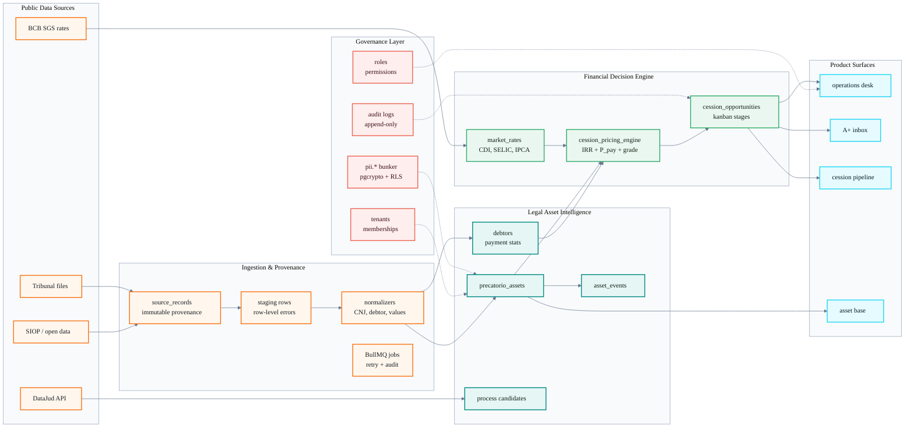
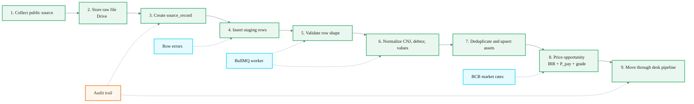

<div align="center">


**Public records become priced, governed precatório opportunities.**

<p>
  <a href="https://adonisjs.com/"></a>
  <a href="https://react.dev/"></a>
  <a href="https://docs.timescale.com/"></a>
  <a href="https://docs.bullmq.io/"></a>
  <a href="./docs/superpowers/specs/2026-04-28-radar-federal-base-design.md"></a>
  <a href="./package.json"></a>
</p>

---

_"The operator should know in seconds: buy, negotiate, monitor, block, or discard."_

</div>

---

> [!IMPORTANT]
> **Operations-first architecture.** JuridicAI is not a generic admin panel. It is an origination desk for precatório opportunities: public source ingestion, legal asset normalization, debtor intelligence, pricing snapshots, pipeline movement, and auditable decisions.

> [!NOTE]
> **Tenant-safe by default.** Domain data is modeled around `tenant_id`, shared access goes through repository boundaries, and sensitive surfaces use PostgreSQL RLS. PII is isolated under `pii.*`, encrypted at rest, revealed through controlled database functions, and audited on every access.

---

## Quick Start

```bash
# Install dependencies
pnpm install

# Create local environment
cp .env.example .env
node ace generate:key

# Start TimescaleDB/PostgreSQL 17 and Redis
docker compose up -d

# Prepare the database
node ace migration:run

# Run the Adonis + Inertia development server
pnpm dev
```

The default app URL is `http://localhost:3333`. Local services bind to `127.0.0.1:5432` for PostgreSQL and `127.0.0.1:6379` for Redis.

---

## Architecture


```mermaid
%%{init: {'theme': 'base', 'themeVariables': {
  'fontFamily': 'ui-monospace, SFMono-Regular, Menlo, Consolas, monospace',
  'lineColor': '#64748b',
  'primaryTextColor': '#111827',
  'clusterBkg': '#f8fafc',
  'clusterBorder': '#94a3b8'
}}}%%
flowchart LR
    subgraph Sources["Public Data Sources"]
        SIOP["SIOP / open data"]
        TRF["Tribunal files"]
        DATAJUD["DataJud API"]
        BCB["BCB SGS rates"]
    end

    subgraph Ingestion["Ingestion & Provenance"]
        SOURCE["source_records<br/>immutable provenance"]
        STAGING["staging rows<br/>row-level errors"]
        NORMALIZE["normalizers<br/>CNJ, debtor, values"]
        JOBS["BullMQ jobs<br/>retry + audit"]
    end

    subgraph Domain["Legal Asset Intelligence"]
        DEBTORS["debtors<br/>payment stats"]
        ASSETS["precatorio_assets"]
        EVENTS["asset_events"]
        MATCHES["process candidates"]
    end

    subgraph Pricing["Financial Decision Engine"]
        MARKET["market_rates<br/>CDI, SELIC, IPCA"]
        PRICING["cession_pricing_engine<br/>IRR + P_pay + grade"]
        PIPELINE["cession_opportunities<br/>kanban stages"]
    end

    subgraph Governance["Governance Layer"]
        TENANTS["tenants<br/>memberships"]
        RBAC["roles<br/>permissions"]
        PII["pii.* bunker<br/>pgcrypto + RLS"]
        AUDIT["audit logs<br/>append-only"]
    end

    subgraph Product["Product Surfaces"]
        DESK["operations desk"]
        INBOX["A+ inbox"]
        KANBAN["cession pipeline"]
        BASE["asset base"]
    end

    SIOP --> SOURCE
    TRF --> SOURCE
    DATAJUD --> MATCHES
    BCB --> MARKET
    SOURCE --> STAGING --> NORMALIZE --> ASSETS
    NORMALIZE --> DEBTORS
    ASSETS --> EVENTS
    DEBTORS --> PRICING
    ASSETS --> PRICING
    MARKET --> PRICING --> PIPELINE
    TENANTS -.-> ASSETS
    RBAC -.-> DESK
    PII -.-> ASSETS
    AUDIT -.-> PIPELINE
    PIPELINE --> DESK
    PIPELINE --> INBOX
    PIPELINE --> KANBAN
    ASSETS --> BASE

    classDef source fill:#FFF7ED,stroke:#F97316,color:#161C24,stroke-width:2px;
    classDef domain fill:#E5F6F5,stroke:#008980,color:#102015,stroke-width:2px;
    classDef pricing fill:#EAF7F0,stroke:#2FAC68,color:#102015,stroke-width:2px;
    classDef governance fill:#FEEEEE,stroke:#EC6553,color:#3B1015,stroke-width:2px;
    classDef product fill:#E6FBFF,stroke:#1CD6F4,color:#031B20,stroke-width:2px;

    class SIOP,TRF,DATAJUD,BCB,SOURCE,STAGING,NORMALIZE,JOBS source;
    class DEBTORS,ASSETS,EVENTS,MATCHES domain;
    class MARKET,PRICING,PIPELINE pricing;
    class TENANTS,RBAC,PII,AUDIT governance;
    class DESK,INBOX,KANBAN,BASE product;
```

---

## Components

| Component                      | Role                                                 | Key Constraint                              |
| :----------------------------- | :--------------------------------------------------- | :------------------------------------------ |
| **`app/modules/operations`**   | Desk, A+ inbox, pipeline, and cession pricing        | Decisions are snapshot-based and auditable  |
| **`app/modules/market`**       | BCB SGS rates and EC 136 correction snapshots        | Pricing must use current market inputs      |
| **`app/modules/integrations`** | DataJud, SIOP open data, and tribunal adapters       | External payloads keep provenance           |
| **`app/modules/siop`**         | SIOP import pipeline, parsers, jobs, staging         | Idempotent imports with immutable sources   |
| **`app/modules/precatorios`**  | Legal asset domain model and repositories            | Tenant-scoped reads and writes              |
| **`app/modules/debtors`**      | Debtor identity and historical payment statistics    | Risk scoring depends on debtor behavior     |
| **`app/modules/pii`**          | PII bunker models, reveal services, policies         | No raw PII in page props or logs            |
| **`app/modules/auth`**         | Session auth, users, tokens                          | Argon2id password hashing                   |
| **`app/modules/tenant`**       | Tenants, memberships, profile, organization settings | One active tenant per session in v0         |
| **`app/modules/permission`**   | RBAC tables and permission services                  | Backend enforcement with Bouncer            |
| **`app/modules/admin`**        | Operational health and job controls                  | Kept out of the primary operator navigation |
| **`app/shared`**               | Base models, repositories, helpers, shared services  | Cross-domain code only                      |

---

## Source-To-Decision Pipeline


```mermaid
%%{init: {'theme': 'base', 'themeVariables': {
  'fontFamily': 'ui-monospace, SFMono-Regular, Menlo, Consolas, monospace',
  'lineColor': '#64748b',
  'primaryTextColor': '#111827'
}}}%%
flowchart LR
    UPLOAD["1. Collect public source"] --> STORE["2. Store raw file<br/>Drive"]
    STORE --> PROVENANCE["3. Create source_record"]
    PROVENANCE --> STAGE["4. Insert staging rows"]
    STAGE --> VALIDATE["5. Validate row shape"]
    VALIDATE --> NORMALIZE["6. Normalize CNJ, debtor, values"]
    NORMALIZE --> UPSERT["7. Deduplicate and upsert assets"]
    UPSERT --> PRICE["8. Price opportunity<br/>IRR + P_pay + grade"]
    PRICE --> PIPELINE["9. Move through desk pipeline"]

    ERRORS["Row errors"] -.-> STAGE
    AUDIT["Audit trail"] -.-> PROVENANCE
    AUDIT -.-> PIPELINE
    WORKER["BullMQ worker"] -.-> VALIDATE
    WORKER -.-> NORMALIZE
    RATES["BCB market rates"] -.-> PRICE

    classDef step fill:#EAF7F0,stroke:#2FAC68,color:#102015,stroke-width:2px;
    classDef side fill:#E6FBFF,stroke:#1CD6F4,color:#031B20,stroke-width:2px;
    classDef audit fill:#FFF7ED,stroke:#F97316,color:#3F3000,stroke-width:2px;

    class UPLOAD,STORE,PROVENANCE,STAGE,VALIDATE,NORMALIZE,UPSERT,PRICE,PIPELINE step;
    class ERRORS,WORKER,RATES side;
    class AUDIT audit;
```

**Pipeline rules:**

- Raw source rows stay traceable through `source_records`.
- Import and enrichment runs are product history, not only queue metadata.
- Staging can fail per row without losing the batch.
- Domain writes must preserve tenant isolation.
- Pricing stores decision inputs instead of recalculating history in place.
- PII reveal is an explicit, audited action.

---

## Data Governance

| Surface           | Protection                                                                                                             |
| :---------------- | :--------------------------------------------------------------------------------------------------------------------- |
| **Multi-tenancy** | Business tables carry `tenant_id`; shared repositories apply tenant scope.                                             |
| **PII bunker**    | Sensitive beneficiary data lives in `pii.*`, with encrypted `bytea` fields and RLS policies.                           |
| **Reveal flow**   | `pii.reveal_beneficiary()` decrypts through a controlled `SECURITY DEFINER` function and logs the access.              |
| **Audit logs**    | `audit_logs`, `security_audit_logs`, and `pii.access_logs` are Timescale hypertables with append-only mutation guards. |
| **Hashing**       | Beneficiary lookup uses peppered hashes; user passwords use Argon2id.                                                  |
| **Logging**       | Pino redaction masks secrets, credentials, tokens, and known PII paths.                                                |

---

## Project Structure

```text
juridicai/
├── app/
│   ├── modules/
│   │   ├── auth/                 # Session auth, users, tokens
│   │   ├── tenant/               # Tenant and membership flows
│   │   ├── permission/           # RBAC models and services
│   │   ├── operations/           # Desk, A+ inbox, cession pipeline, pricing
│   │   ├── market/               # BCB rates and EC 136 correction snapshots
│   │   ├── integrations/         # DataJud, SIOP open data, tribunal adapters
│   │   ├── siop/                 # Import controllers, jobs, parsers, services
│   │   ├── precatorios/          # Legal asset models and repositories
│   │   ├── debtors/              # Debtor models and services
│   │   ├── pii/                  # PII bunker services and policies
│   │   ├── exports/              # Export jobs and records
│   │   ├── dashboard/            # Read-only product metrics
│   │   ├── admin/                # Admin and health surfaces
│   │   ├── healthcheck/          # Public health endpoints
│   │   ├── client_errors/        # Browser/client error intake
│   │   └── maintenance/          # Retention, aggregate, and worker jobs
│   └── shared/
│       ├── helpers/              # Tenant context, RLS, redaction, timing
│       ├── models/               # Tenant base models
│       ├── repositories/         # Tenant-aware base repository
│       ├── services/             # Cross-domain services
│       └── types/                # Shared TypeScript contracts
├── config/                       # Adonis, database, Redis, Drive, logger config
├── database/
│   ├── migrations/               # Ordered operations, radar, PII, audit migrations
│   └── factories/                # Japa/Lucid factories for domain models
├── docs/superpowers/
│   ├── specs/                    # Product and architecture specs
│   └── plans/                    # Implementation plans
├── inertia/                      # Inertia + React pages, layouts, CSS
├── start/                        # Routes, middleware, env validation
├── tests/                        # Japa bootstrap and suites
├── docker-compose.yml            # TimescaleDB HA PG17 + Redis
└── package.json                  # Scripts, aliases, runtime dependencies
```

---

## Build & Operations

<details>
<summary><strong>Prerequisites</strong></summary>

| Tool       | Version                                             |
| :--------- | :-------------------------------------------------- |
| Node.js    | `>= 24.0.0`                                         |
| pnpm       | `>= 10.0.0`                                         |
| Docker     | Required for local PostgreSQL/TimescaleDB and Redis |
| PostgreSQL | TimescaleDB HA image on PG17 for local development  |
| Redis      | Redis 7 for sessions and queue-backed work          |

</details>

```bash
# Development server with HMR
pnpm dev

# Production build
pnpm build

# TypeScript checks for backend and Inertia
pnpm typecheck

# ESLint
pnpm lint

# Japa test suite
pnpm test

# List registered routes
node ace list:routes

# Database lifecycle
node ace migration:run
node ace migration:rollback
node ace migration:fresh
node ace db:seed
```

### Environment

Start from `.env.example`. The required local variables are:

| Variable             | Purpose                                                            |
| :------------------- | :----------------------------------------------------------------- |
| `APP_KEY`            | Adonis encryption/session key generated by `node ace generate:key` |
| `DB_*`               | PostgreSQL connection to the TimescaleDB container                 |
| `REDIS_*`            | Redis connection used by sessions and worker infrastructure        |
| `PII_HASH_PEPPER`    | Pepper for beneficiary hash generation                             |
| `PII_ENCRYPTION_KEY` | Key used by PII reveal/decrypt flows                               |
| `DRIVE_DISK`         | Local Drive disk, defaults to `fs`                                 |

---

## Current Foundation

| Area              | Status                                                                                                     |
| :---------------- | :--------------------------------------------------------------------------------------------------------- |
| **Runtime stack** | AdonisJS 7, Inertia 4, React 19, Lucid 22, PostgreSQL, Redis, Drive, Bouncer                               |
| **Operations**    | A+ inbox, operations desk, cession pipeline, persisted opportunity snapshots, pricing calculator           |
| **Market data**   | BCB SGS adapter for CDI, SELIC, IPCA, and EC 136 correction snapshots                                      |
| **Integrations**  | SIOP import/open data, TRF adapters, DataJud enrichment and candidate review services                      |
| **Security**      | Argon2id hashing, logger redaction, tenant context helpers, RLS helpers                                    |
| **Database**      | Ordered migrations for tenancy, RBAC, sources, assets, debtors, pricing, PII, audit, jobs, exports, views  |
| **TimescaleDB**   | Hypertables for audit logs, security logs, PII access logs, job runs, and worker heartbeats                |
| **Modules**       | Domain folders under `app/modules/*` with controllers, models, repositories, services, jobs, validators    |
| **Factories**     | Lucid factories for tenants, users, RBAC, SIOP, assets, PII, market data, operations, audit, jobs, exports |

---

## Development Rules

- Keep code, comments, and developer-facing strings in English.
- Prefer Ace generators for Adonis artifacts: `node ace make:model`, `make:controller`, `make:migration`, `make:factory`.
- Put domain code in `app/modules/<domain>/`; put reusable cross-domain code in `app/shared/`.
- Use aliases such as `#modules/*` and `#shared/*` instead of deep relative imports.
- Never expose raw PII in Inertia props, logs, exceptions, or exports.
- Run `pnpm typecheck` and `pnpm lint` before committing implementation work.

---

## Roadmap

| Track               | Scope                                                                 |
| :------------------ | :-------------------------------------------------------------------- |
| **Operations desk** | Sharper operator UX, bulk actions, SLA alerts, and opportunity review |
| **Source coverage** | More tribunal feeds, DJEN publications, municipal and state sources   |
| **Pricing quality** | Deeper debtor history, EC 136 edge cases, tax/cost modeling           |
| **Commercial flow** | Contact tasks, offers, due diligence checklist, assignment tracking   |
| **Observability**   | Worker health, retry controls, source freshness, data quality scores  |

---

## License

This repository is currently private and marked `UNLICENSED` in `package.json`.

---

<div align="center">


</div>
